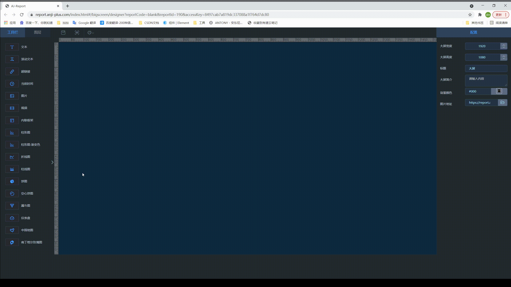

&emsp;  &emsp;  AJ-Report是一个完全开源的BI平台，酷炫大屏展示，能随时随地掌控业务动态，让每个决策都有数据支撑。<br>
&emsp;  &emsp;  多数据源支持，内置mysql、elasticsearch、kudu等多种驱动，支持自定义数据集省去数据接口开发，支持17种+大屏组件，不会开发，照着设计稿也可以制作大屏。<br>
&emsp;  &emsp;  三步轻松完成大屏设计：配置数据源---->写SQL配置数据集---->拖拽配置大屏---->保存发布。欢迎体验。

## 系统特性
1. 最新最稳定的技术栈；
2. 支持多数据源配置
3. 丰富的大屏组件。拖拽配置实现动态大屏

## 在线体验
#### &emsp;  电脑在线体验: [https://report.anji-plus.com/index.html](https://report.anji-plus.com/index.html "链接")  &emsp;体验账号：guest  密码：guest
#### &emsp;  在线文档: [https://report.anji-plus.com/report-doc/](https://report.anji-plus.com/report-doc/ "doc")<br>
#### &emsp;  在线提问: [https://gitee.com/anji-plus/report/issues](https://gitee.com/anji-plus/report/issues "issue")<br>

## 发行版本
#### &emsp;  下载链接：[https://gitee.com/anji-plus/report/releases](https://gitee.com/anji-plus/report/releases "下载链接")<br>

## 功能概述
#### &emsp;  组件介绍
&emsp;&emsp; 大屏设计（AJ-Report）是一个可视化拖拽编辑的，直观，酷炫，具有科技感的图表工具全开源项目。
内置的基础功能包括数据源，数据集，报表管理，项目部分截图如下。<br>
**在线案例还在努力创造中，敬请期待！！！**


## 数据流程图


## 打包目录
```
├── bin                                           启动命令脚本
│   ├── restart.sh
│   ├── start.bat
│   ├── start.sh
│   └── stop.sh
├── conf                                       配置文件目录
│   └── bootstrap-dev.yml
├── logs                                          启动日志目录
├── cache                                         本地缓存目录
├── lib                                           自定义扩展包&report-core核心包
```

## 系统目录
```
├── doc                                           文档源码
│   ├── docs
│   ├── package.json
│   └── README.md
├── pom.xml                                       父pom，jar版本管理
├── report-core                                   java源码
│   ├── pom.xml                                   gaea父pom，jar版本管理
│   └── README.md
├── report-ui                                     前端vue源码
├── LICENSE
├── README.md
```


