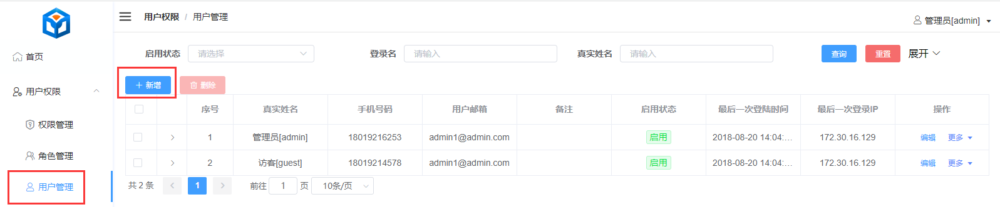
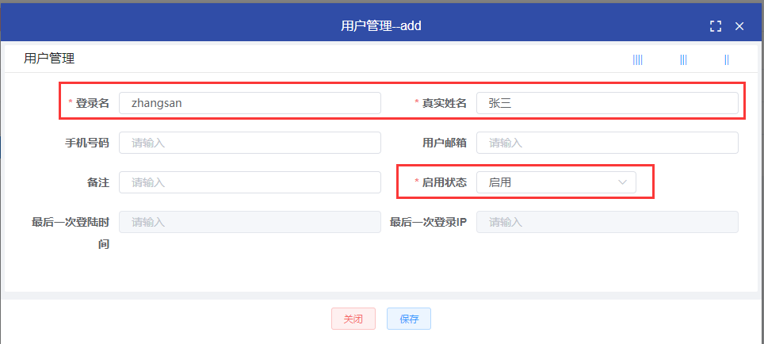
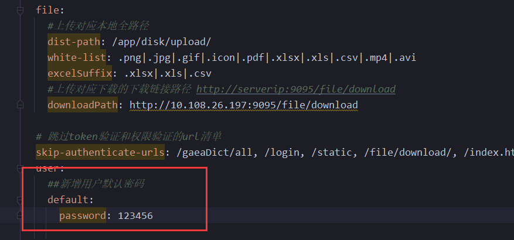
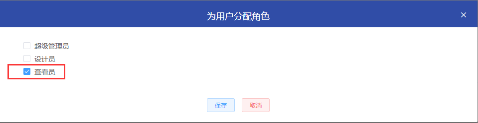
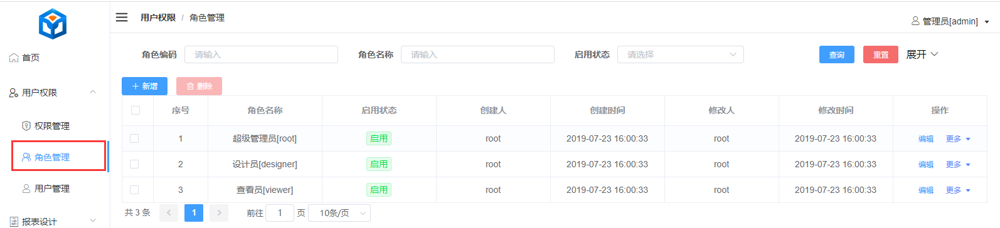
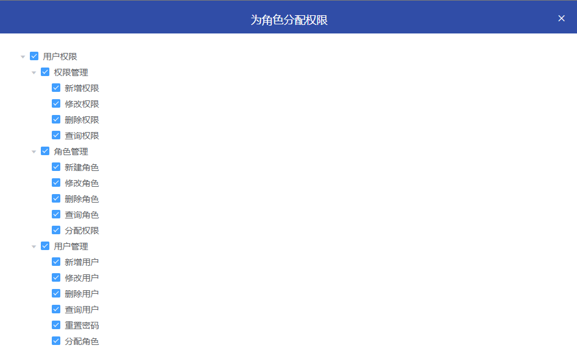

## 新增用户

  

  

新增用户的默认密码是在bootstrap.yml文件中配置的  

  

## 用户授权

**注意**：新建用户完成后需要给用户授权，否则新用户登陆是啥也看不到。 
  

  
**注**：这里没有给新用户赋予默认角色的原因是，在角色管理中角色是可以被删除和修改的，因此在新建用户时需要手动的去授权角色  

## 角色管理

  

## 权限分配

为角色分配权限，可看已有角色示例  
  

## 导入导出权限

**注**：现在guest用户的权限是底层写死只有访问权限，无实质操作权限。 
导入导出的权限是在 角色 --> 分配权限中控制。  

  
用户绑定了角色，角色则绑定了权限，是这样一层关系。  

