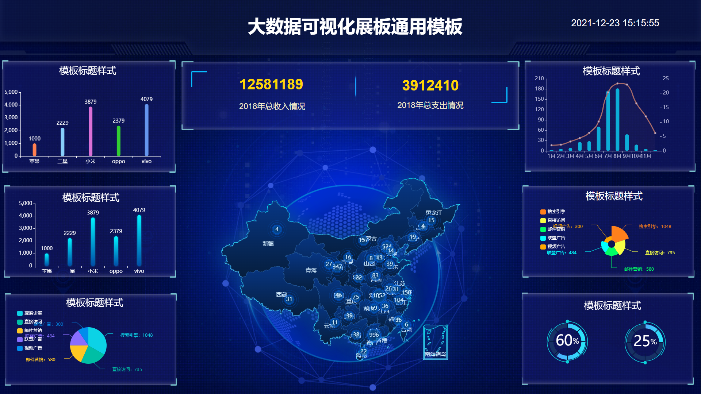
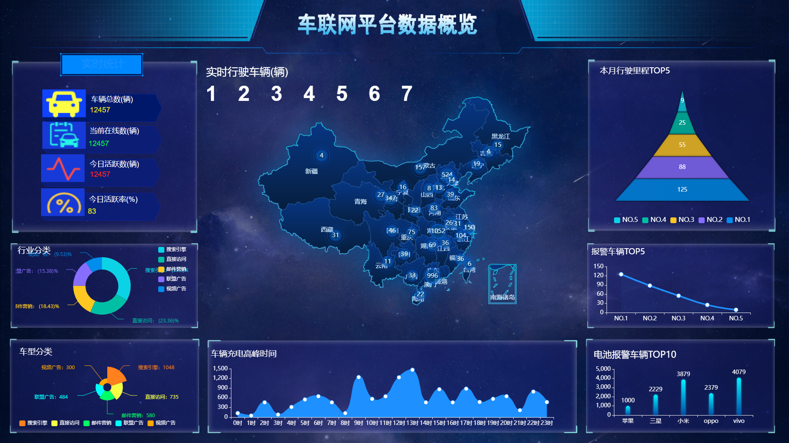
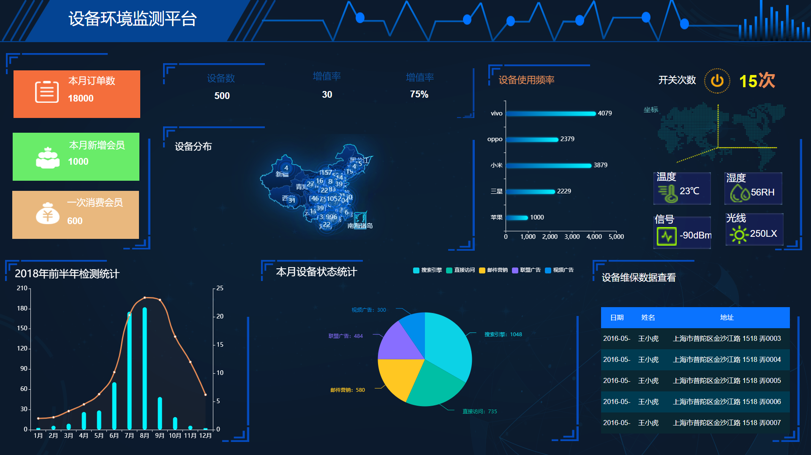
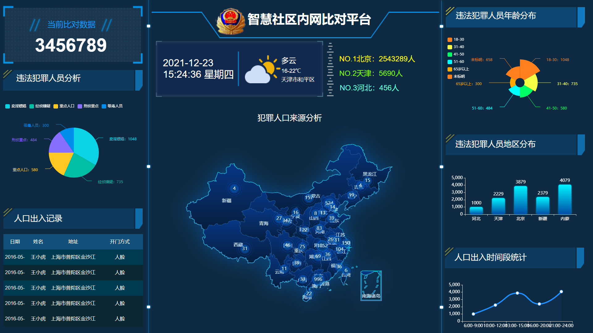
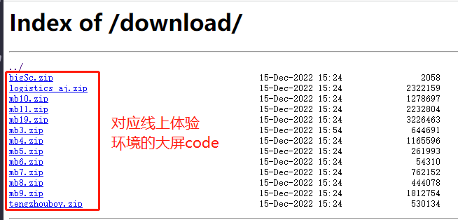
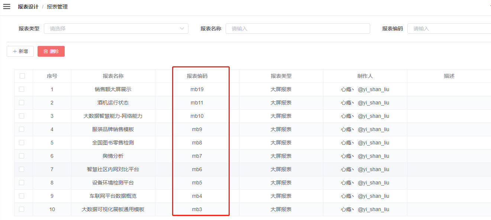
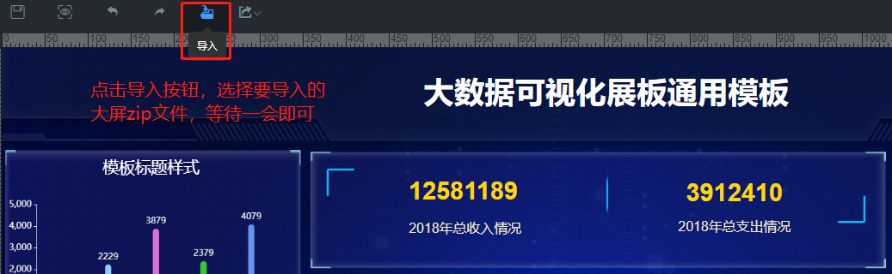
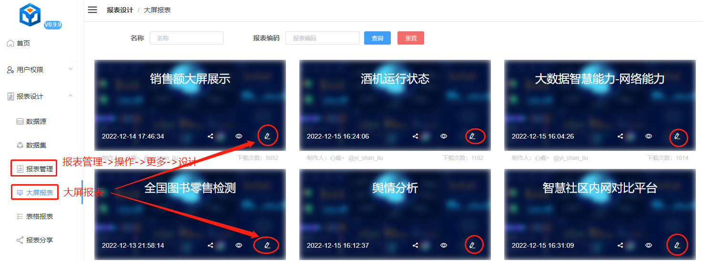

## 社区提供

### **[~无痕~@tengzhouboy](https://gitee.com/tengzhouboy)** 提供  

[AJ-Report分享链接](https://ajreport.beliefteam.cn/index.html#/aj/mtwbjPot)  

  

### **[心瘾丶 @yi_shan_liu](https://gitee.com/yi_shan_liu)** 提供  

[AJ-Report分享链接](https://ajreport.beliefteam.cn/index.html#/aj/hkBJgLW0)  

  

[AJ-Report分享链接](https://ajreport.beliefteam.cn/index.html#/aj/Hgfi4pj5)  
  

[AJ-Report分享链接](https://ajreport.beliefteam.cn/index.html#/aj/zJa5Wwey)  
  

[AJ-Report分享链接](https://ajreport.beliefteam.cn/index.html#/aj/D0cpO4re)  
  

## 大屏下载

**注：在线体验环境因为服务器配置问题，点击导出反应较慢，因此推荐直接下载你想要的大屏zip包即可**  

- 通过[下载链接](https://ajreport.beliefteam.cn/download/)下载  

  1、下载对应大屏的zip包  
    
    

  2、在自己的服务环境通过“报表管理”菜单新建一个大屏，点击设计进入大屏设计界面。 
    

 

- 通过在线体验环境导出大屏  

  1、进入对应大屏的设计界面  
    

  2、在自己的服务环境通过“报表管理”菜单新建一个大屏，点击设计进入大屏设计界面。 
    
