## 图表和数据集之间的关系

图表和数据集是强关联关系，一个图表需要什么样的数据才能进行展示下面都有说明，以柱状图举例，只能用两个字段的数据集进行数据展示，那使用数据集有2个以上字段那肯定图表无法正常展示，反之有个数据集是3个字段，那就找能展示3个字段的图表，千万别搞小聪明定了好多个字段的数据集，然后从里面挑几个字段进行展示，不要这么干。 

## 文本栏

### 文本框

  
  
  
  

#### 数据格式

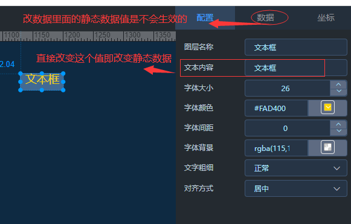  

### 滚动文本

同文本框，操作无异。  

### 超链接

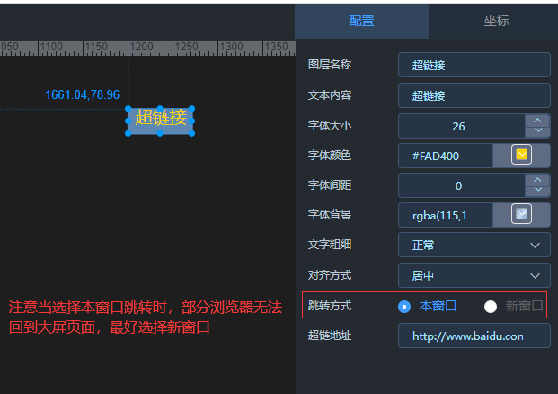  

**如有问题，请提交 [Issue](https://gitee.com/anji-plus/report/issues)  **

### 当前时间

已支持多种时间格式，其他格式请提交 [Issue](https://gitee.com/anji-plus/report/issues)  
  

### 图片

  
**注：** 如果没有在bootstrap.yml配置文件中没有正确配置上传下载的路径，这里肯定是失败的。  

### 视频

**注：** 视频的地址应是直接可以访问的，不需要登录之类。  
**暂不支持视频循环播放** 

### 表格

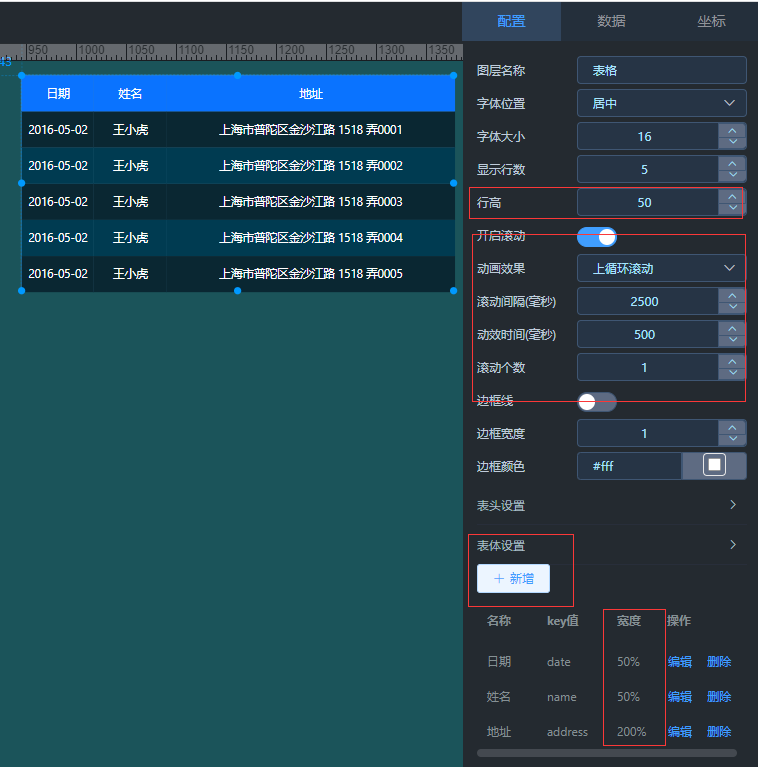  
表格字段对应的数据只选择“文本数字”。 
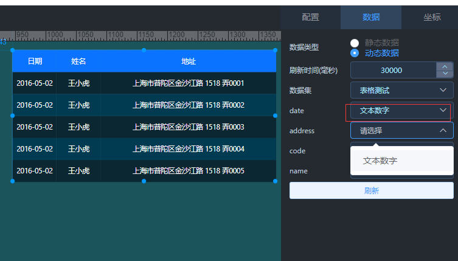  
**注意：**
多个字段的时候，需要在“配置-新增”添加你选择数据集所对应的字段，即“配置”中“表体设置”的“key值”要和你“动态数据对应的字段名”保持一致，类似于映射关系。  

**如有问题，请提交 [Issue](https://gitee.com/anji-plus/report/issues)  **

### 内联框架

当超链接和视频链接无效的时候，请尝试使用内联框架。  

## 样式组件

### 边框

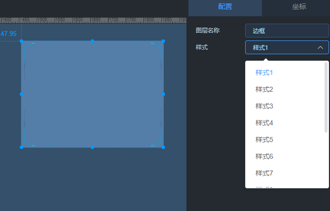  

### 装饰

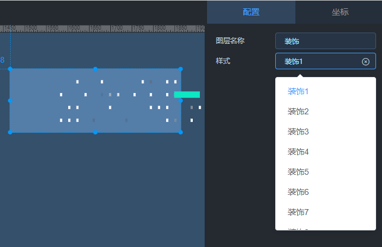  

### 装饰饼图

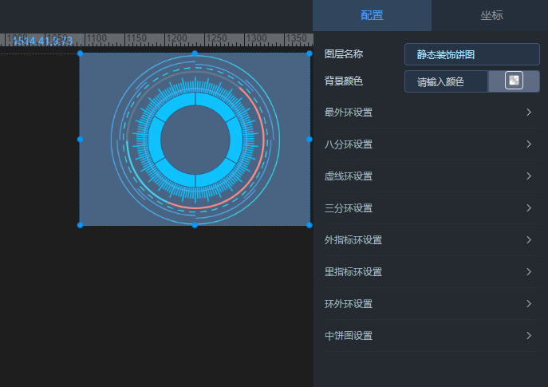  

## 柱状图

### 柱状图

柱状图数据集对应字典值需要选择一个“X轴”、“柱状”，只需要2个字段。  
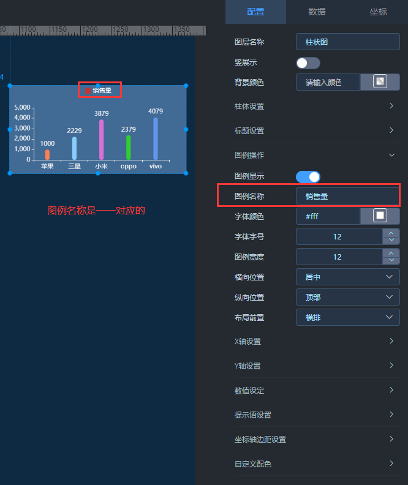  

#### 数据格式

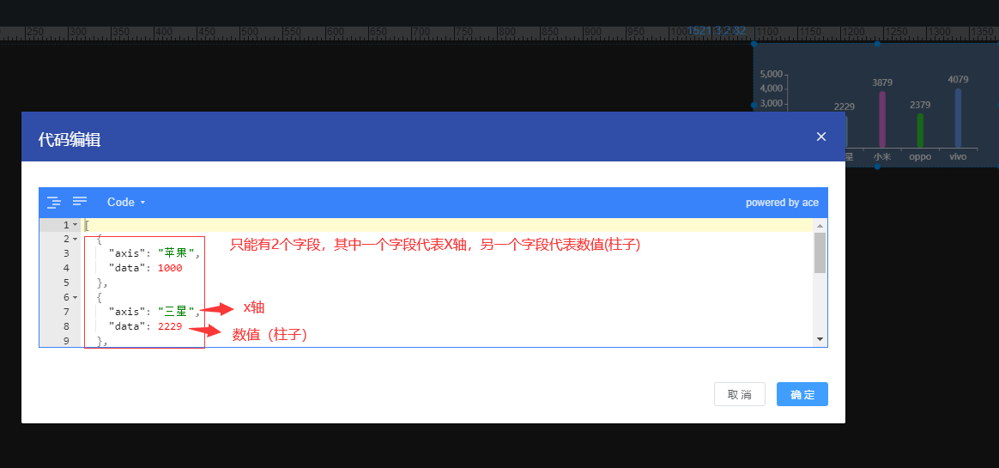  

**如有问题，请提交 [Issue](https://gitee.com/anji-plus/report/issues)  **

### 柱状图-渐变色

同上柱状图，颜色调整为支持渐变色。  

**如有问题，请提交 [Issue](https://gitee.com/anji-plus/report/issues)  **

### 柱状堆叠图

动态的数据集对应字典值需要选择一个“X轴”、“Y轴”、“柱状”，也就是说需要3个字段，不明白可以看看静态数据。  
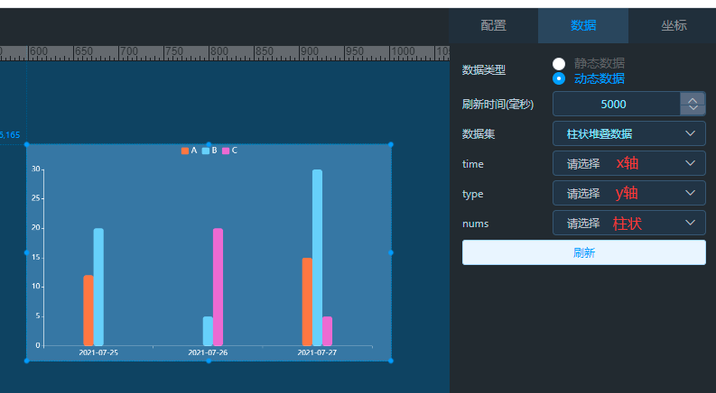  

#### 数据格式

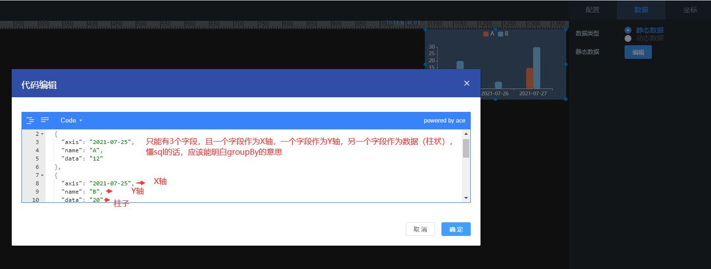  

**如有问题，请提交 [Issue](https://gitee.com/anji-plus/report/issues)  **

### 柱状对比图

数据集需要3个字段，其中一个作为对比的字段只能为2种值，只有2种值作为对比的字段要选择“y轴字段”字典。因为底层的解析用的是堆叠图的解析，这里的y轴字段并不是指的图表上面的y轴，还请注意，有强迫症可以自行修改源码的解析，剩下的2个字段对应字典看图。  
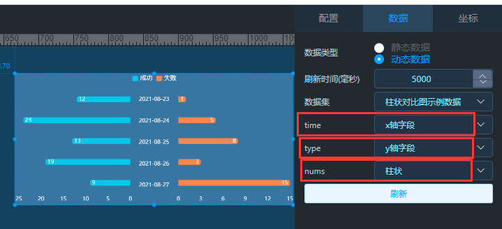  

#### 数据格式

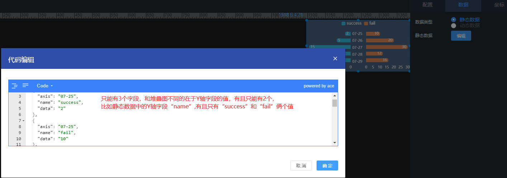  

**如有问题，请提交 [Issue](https://gitee.com/anji-plus/report/issues)  **

### 双Y柱图

数据集需要3个字段，其中一个字段作为“X轴”，另外两个数值字段选择“柱状”，左右Y轴分别代表选择柱状的俩种数值。  
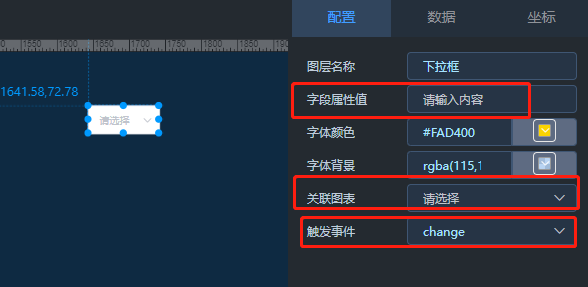  

#### 数据格式

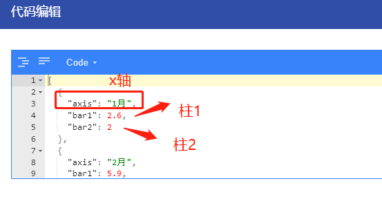  

**如有问题，请提交 [Issue](https://gitee.com/anji-plus/report/issues)  **

## 折线图

### 折线图

折线图数据集对应字典值需要选择一个“X轴”、“折线”，只需要2个字段。  
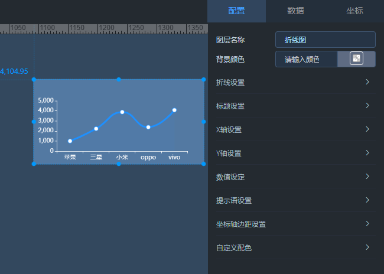  

#### 数据格式

同柱形图数据格式一致。  

**如有问题，请提交 [Issue](https://gitee.com/anji-plus/report/issues)  **

### 折线堆叠图

动态的数据集对应字典值需要选择一个“X轴”、“Y轴”、“折线”，也就是说需要3个字段，不明白可以看看静态数据。  
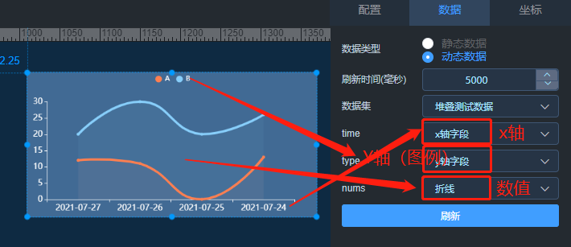  

#### 数据格式

同柱状堆叠图数据格式一致。  

**如有问题，请提交 [Issue](https://gitee.com/anji-plus/report/issues)  **

### 折线对比图

数据集需要3个字段，其中一个作为对比的字段只能为2种值，只有2种值作为对比的字段要选择“y轴字段”字典，剩下的字典对应看图。  
  

**注**：如果提示语设置选择“十字形”，请注意需要选择“X轴颜色、上Y轴颜色、下Y轴颜色”，不然预览图表鼠标选择是全白色，还请注意。 
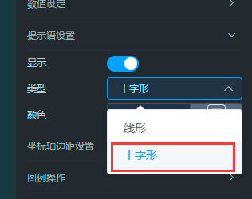  

#### 数据格式

同柱状对比图数据格式一致。  

**如有问题，请提交 [Issue](https://gitee.com/anji-plus/report/issues)  **

## 柱线图

### 柱线图

柱线图数据集对应字典值需要选择一个“X轴”、“柱状”、“折线”，需要3个字段，图例名称用 | 进行分隔。 
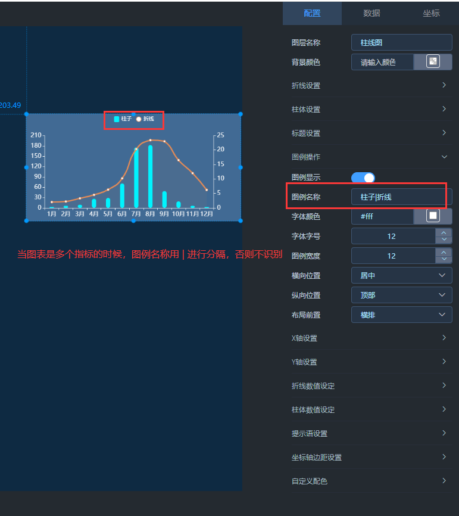  

#### 数据格式

  

**如有问题，请提交 [Issue](https://gitee.com/anji-plus/report/issues)  **

### 多柱线图

多柱线图对应数据字典需要选择一个“X轴”，剩下的字段可任意选择为“柱状”、“折线”，图例名称用 | 进行分隔。 
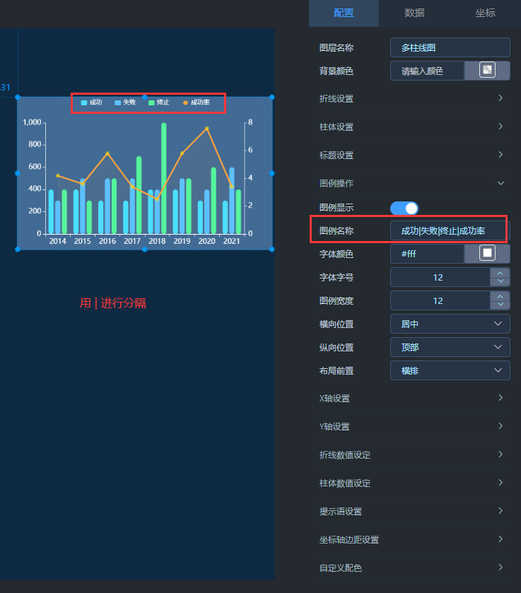  

#### 数据格式

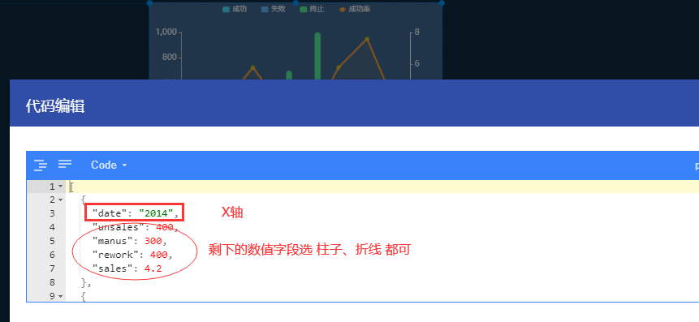  

**如有问题，请提交 [Issue](https://gitee.com/anji-plus/report/issues)  **

### 柱线堆叠图

图表的基本操作和柱状堆叠图、折线堆叠并无大区别，需要在意的是数据格式的区别，绑定动态数据的时候，需要你数据集有4个字段，其中两个字段作为x，y区分字段，另外俩个作为数值字段。 
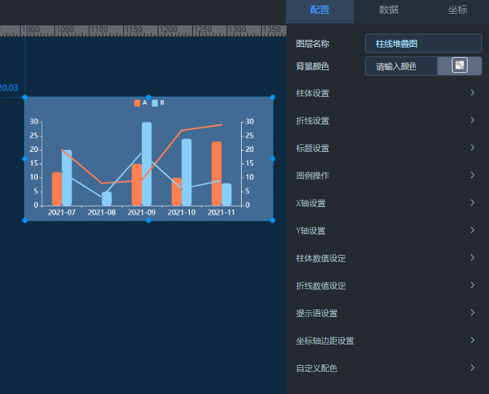  
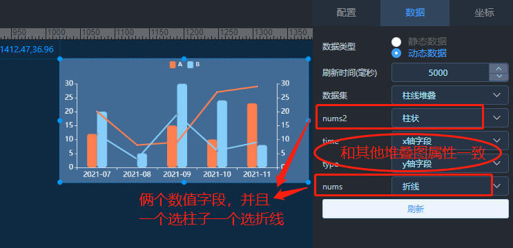  

#### 数据格式

和另外俩个堆叠图相比，多了查询的一列数据，比如 "select a,b,sum(c),sum(d) from aa group by a,b" 。
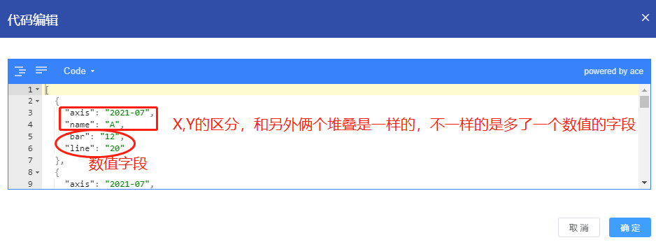  

**如有问题，请提交 [Issue](https://gitee.com/anji-plus/report/issues)  **

## 饼图

### 饼图

饼图的数据集选择的时候，只能选择饼图对应的字典，即“Name”、“Value”，不明白可以参考静态数据。  
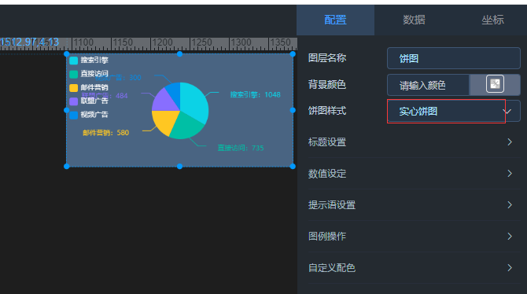  
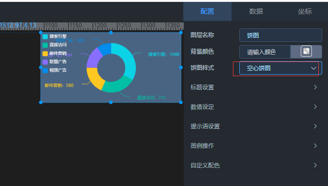  

#### 数据格式

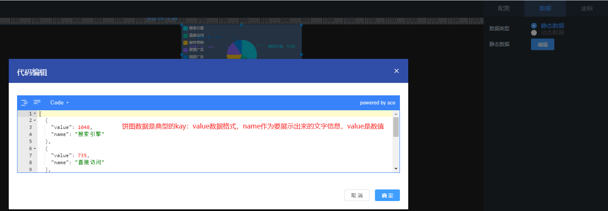  

**如有问题，请提交 [Issue](https://gitee.com/anji-plus/report/issues)  **

### 南丁格尔玫瑰图

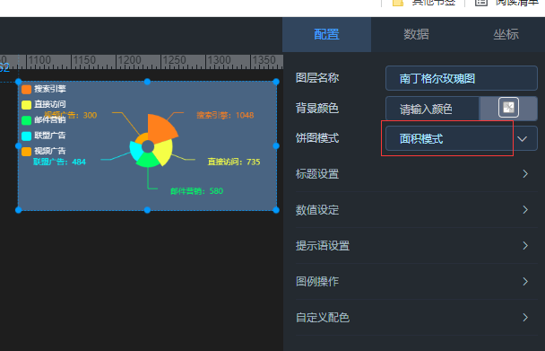  
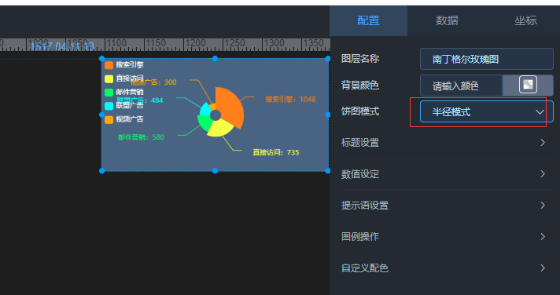  

#### 数据格式

同饼图数据格式一致。  

**如有问题，请提交 [Issue](https://gitee.com/anji-plus/report/issues)  **

## 漏斗图

### 漏斗图

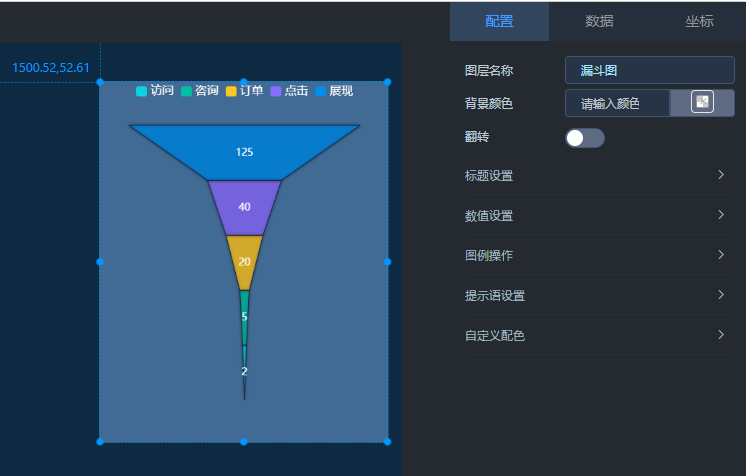  

#### 数据格式

同饼图数据格式一致。 

**如有问题，请提交 [Issue](https://gitee.com/anji-plus/report/issues)  **

## 百分比

### 仪表盘

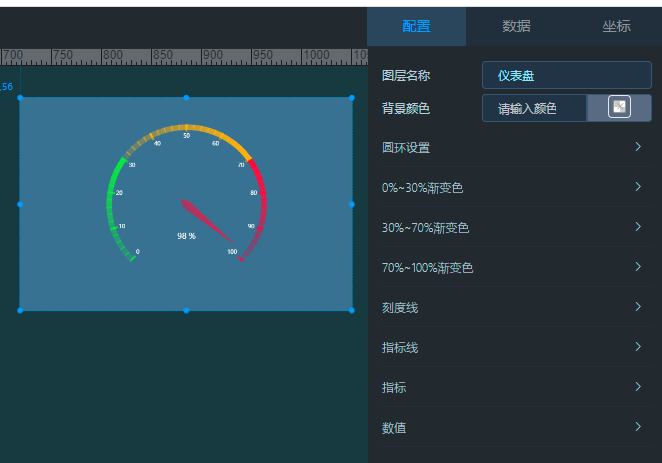  

#### 数据格式

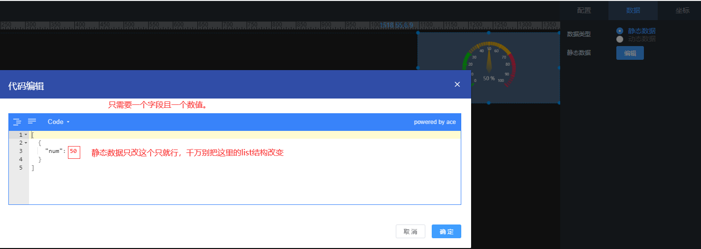  

**如有问题，请提交 [Issue](https://gitee.com/anji-plus/report/issues)  **

### 百分百图

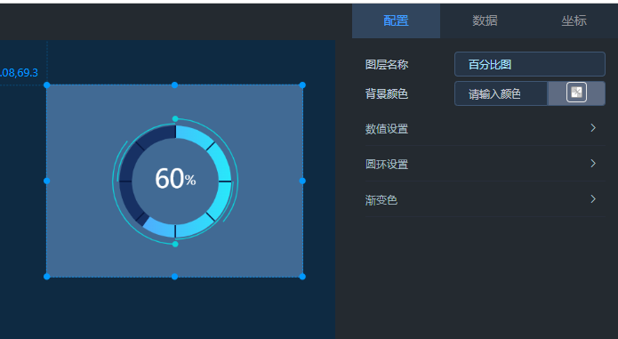  

#### 数据格式

同仪表盘数据格式一致。  

**如有问题，请提交 [Issue](https://gitee.com/anji-plus/report/issues)  **

## 中国地图

### 路线地图

路线图的动态数据集，需要3个字段，“源端”代表起点，“目标端”代表终点，“数值”代表俩点之间的值。  
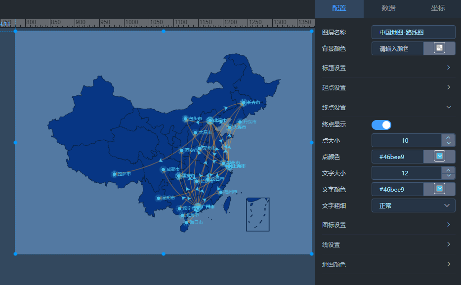  

#### 数据格式

可以参考静态数据，目前路线地图仅能显示“市”级别，注意地图数据名称要和地图底层数据名称保持一致，即完整的市名，可以看静态数据，如果和你提供的动态数据名称有差异，请参考源码自行修改。  
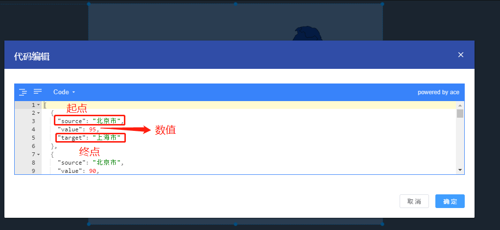  

**如有问题，请提交 [Issue](https://gitee.com/anji-plus/report/issues)  **

### 气泡地图

气泡地图动态数据集，和饼图一样，对应字典值需要选择一个“Name”、“Value”，且name的字段值要和echarts图表里面的值能对应上，可参考静态数据。  
  

#### 数据格式

可参考静态数据，目前气泡地图仅能显示“省”级别，注意动态数据的名称要和地图底层数据名称保持一致，即完整的省名，可以看静态数据，如果和你提供的动态数据名称有差异，请参考源码自行修改。  

**如有问题，请提交 [Issue](https://gitee.com/anji-plus/report/issues)  **

## 词云图

### 词云图

最大最小角度都为0时则文字显示为”正“。所有词云颜色皆是随机产生，动态数据每请求一次数据，所有词云颜色皆改变一次。 
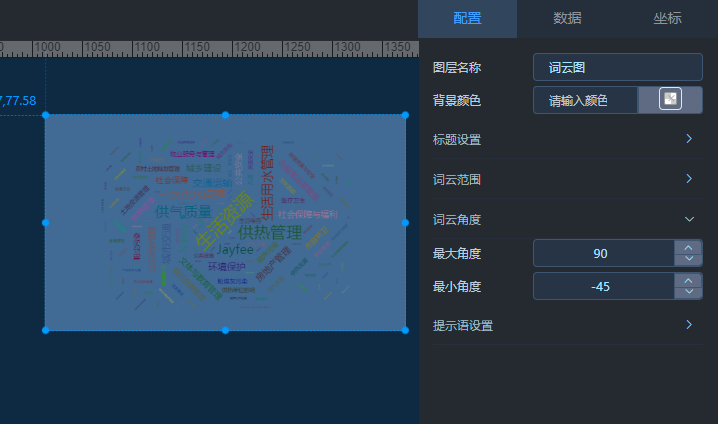  

#### 数据格式

同饼图、南丁格尔玫瑰图数据一致。 

**如有问题，请提交 [Issue](https://gitee.com/anji-plus/report/issues)  **

## 热力图

### 热力图

热力图是类似坐标轴一样的数据，当前的热力图数据集需要3个字段值，对应的字典是选择“X轴”，“Y轴”，“数值”，不明白可以看静态数据。  
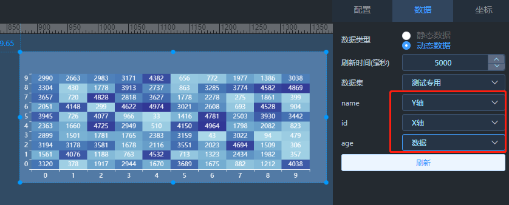  

**注意：**
图设置功能中的最大最小值将会对热力图中的数值产生反应，主要根据设定的颜色来反应，数值越靠近最大值，颜色将更深。  
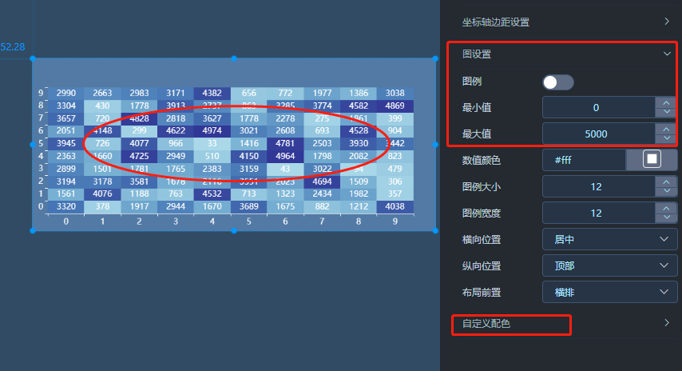  

#### 数据格式

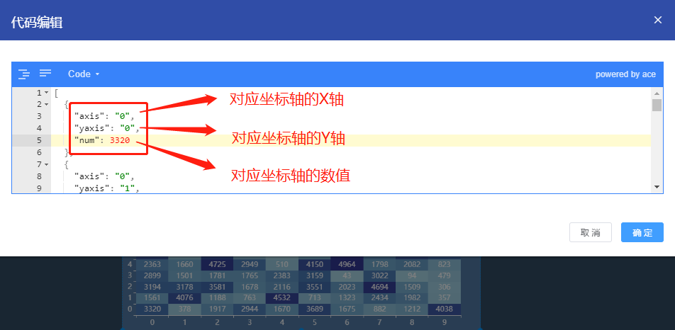  

**如有问题，请提交 [Issue](https://gitee.com/anji-plus/report/issues)  **

## 雷达图

### 雷达图

基本操作和表格一致，通过配置栏的新增按钮和操作按钮对雷达顶点数量进行修改，可生成5边雷达，6边雷达等等，”key值“和”雷达顶点“保持一致，从最上端顶点逆时针规划其他顶点。 
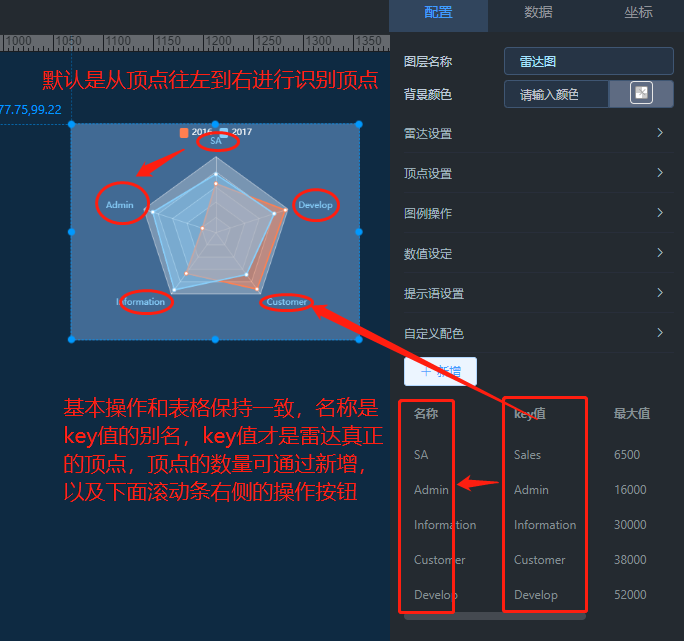  

#### 数据格式

数据格式和柱线、多柱线都是类似的，注意实际作为”名称“的字段，比如时间字段，有且只能有1个，其余是”雷达顶点“字段，不明白可以看静态数据格式。 
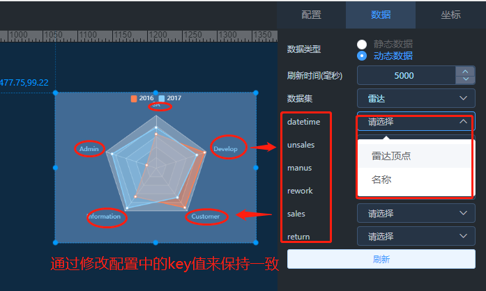  
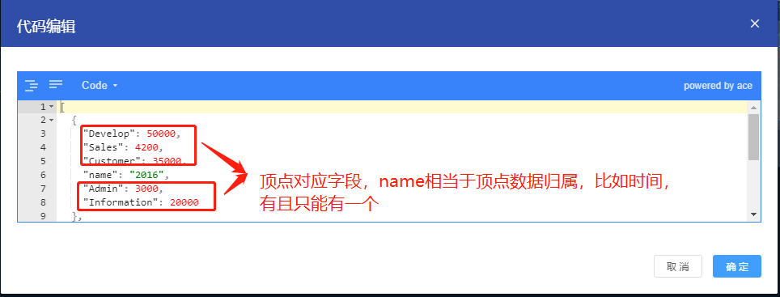  

**如有问题，请提交 [Issue](https://gitee.com/anji-plus/report/issues)  **

## 刻度尺

### 竖刻度尺

刻度尺数值的颜色来源于配置的渐变色，渐变色分为0%-30%-50%-70%-100%，数值颜色的变化会随着数值所在颜色区间的变化而变化。通过刻度设定可以调整最大刻度，默认刻度是100。 
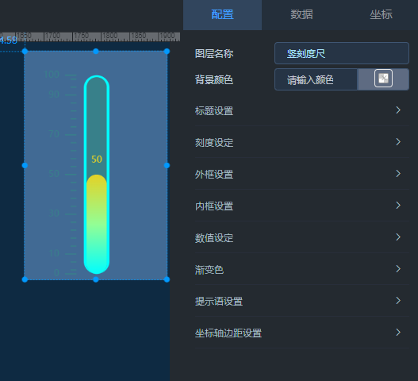  
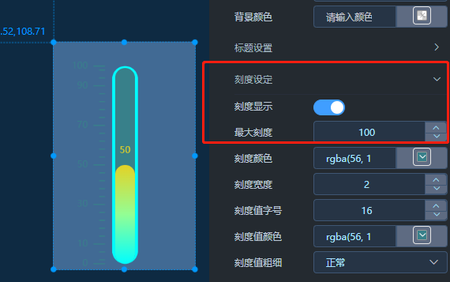  

#### 数据格式

单一的数值字段，可看静态数据。

### 横刻度尺

同竖刻度尺。 
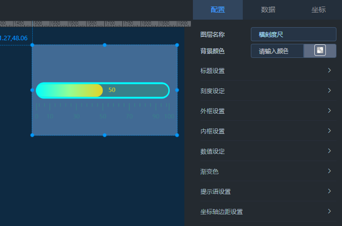  

#### 数据格式

单一的数值字段，可看静态数据。

## 表单

### 下拉框

下拉框组件联动的使用方式请看图表联动里面的详细描述。 
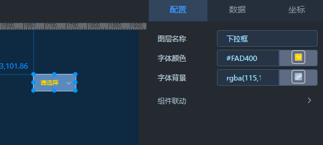  

#### 数据格式

“提交值”指的是下拉框提交给联动的组件字段名和字段值，“显示值”是指下拉框自身下拉按钮显示的值。动态数据需要至少1个字段，如果只有一个字段请选择“提交值”，最多2个字段，“提交值”“显示值”，只能选择一个，不能同时都选。 
注意下拉框的静态数据只是作为参考用的，并不参与解析。 
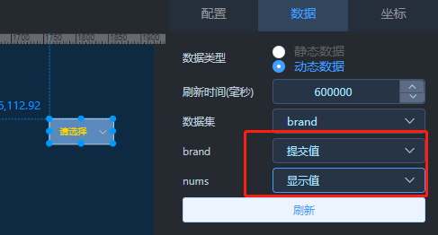  

**如有问题，请提交 [Issue](https://gitee.com/anji-plus/report/issues)  **

### 时间筛选器

默认支持的时间格式是"yyyy-MM-dd HH:mm:ss"，其他日期格式暂不支持，需要自己把自己数据集中时间字段格式化成同种格式。 
时间筛选器组件联动的使用方式请看图表联动里面的详细描述。 
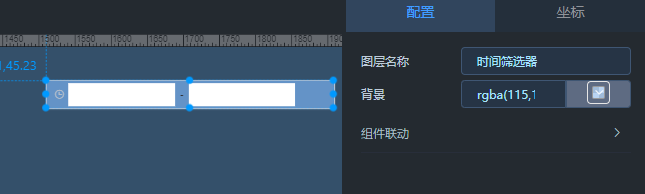  
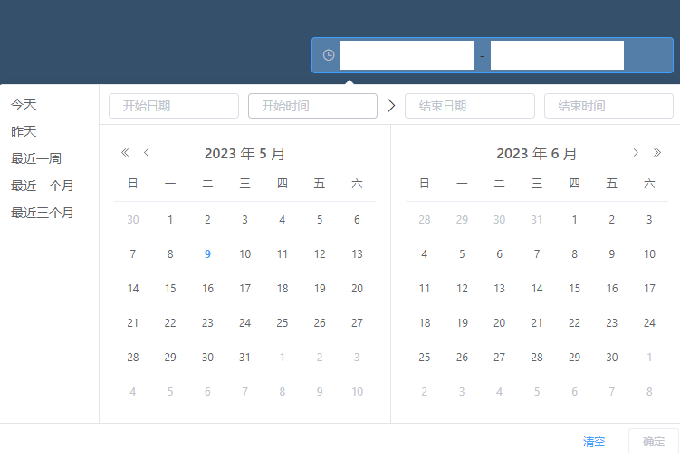  

