## 简要说明

现有系统的联动有俩种。 

- 表单联动  
  目前支持的有下拉框、时间筛选器俩种。 

- 图表联动： 
  目前联动主要集中在柱状图、折线图、饼图等这种二维图表，二维图表是指图表只支持2个字段的数据集，当然并不是说需要3个字段的堆叠图（柱状/折线）不支持联动，而是这种三维图表去联动二维图表会带来一些问题，反之二维的去联动三维的同样存在问题，因此目前源代码中只添加了部分二维图表的联动。 

## 表单联动

### 下拉框

- 简介-数据格式  
  下拉框最多两个字段，数据字典对应“显示值（label）”、“提交值（value）”，“提交值”是必须选择的，当动态数据只有一个字段的时候，选择“提交值”也会将其默认展示为“显示值”。 

- 联动说明  
  被联动的组件：当前大屏中除自身以外的其他图表组件，这里获取的是图表的图层名称，每个图表都有默认的图层名称，因此有相同图表存在的话，记得修改图层名称。 
  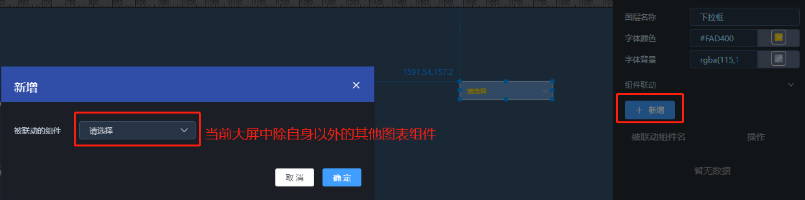  

  参数配置：label和value是下拉框自身字典属性。 
  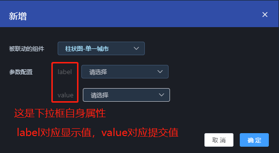  

  选择联动的图表后，可以获得该图表配置的数据集，并获得数据集中的查询参数，然后将该查询参数进行绑定label、value。  
  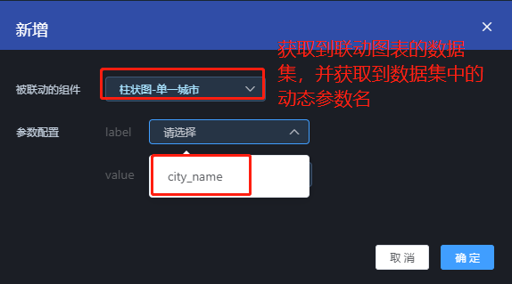  

  下拉联动的时候就是将下拉框（label/value）的数据提交给联动图表的查询参数，绑定label就是将下拉框label的值传递给图表的查询参数，同理value，只有一个查询参数的情况下肯定不能同时绑定label、value。 
  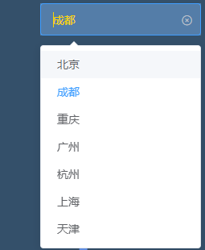  

- **使用注意 ！！！**  
  首先每个有查询参数的数据集都有对应查询参数的示例值，那么此数据集的数据则是根据此查询参数执行后的结果;  
  下拉框在使用时，则是将下拉选择的值传递给此查询参数来获得新的数据;  
  当使用下拉框后，已经将值传递给了某数据集的查询参数，这时候将下拉框的值清空并不会意味着传了空值给查询参数，且当数据集的刷新时间到了后也只会按下拉框传递的参数值进行查询;  
  那么在使用下拉框查询后，想恢复原本数据集的数据只需要刷新浏览器即可。 

- 示例  
  示例中的数据集相关的sql写在 aj_report_init.sql文件中，请自行查看。 
  1、先准备两个数据集  
  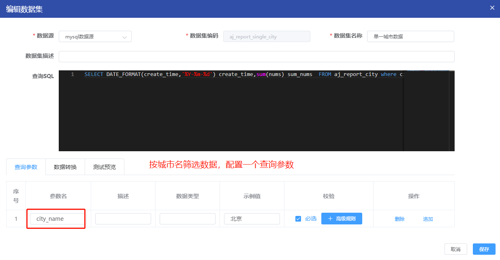  
  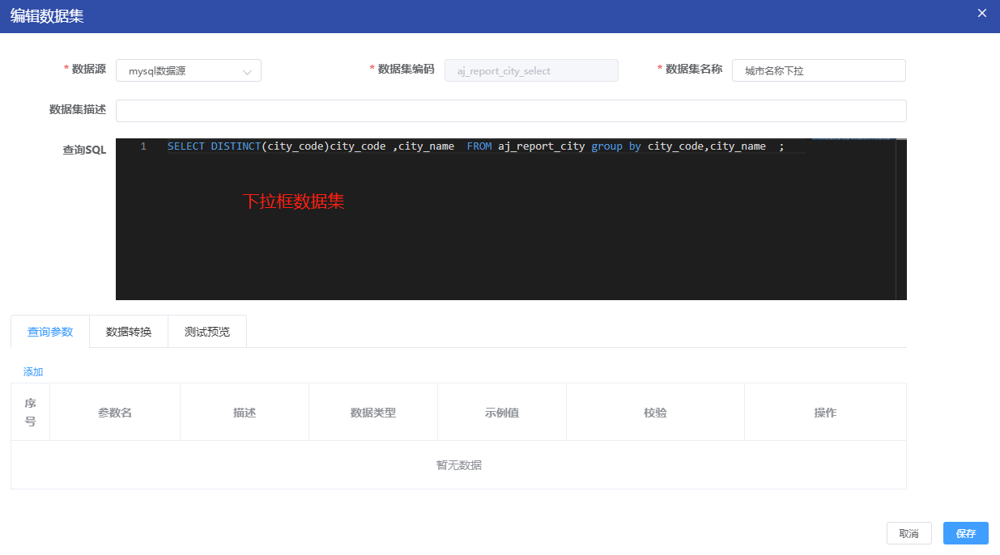  

  2、给下拉框配置动态数据，并设置好“提交值”、“显示值”字段  
  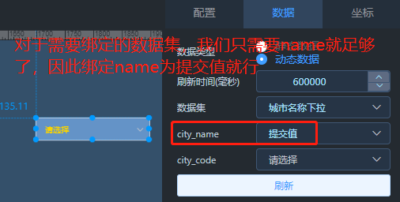  

  3、联动配置-参数配置  
  下拉框数据集绑定的是“提交值”，也就是label，这里也就是将label的值传递给柱状图数据集的查询参数city_name。 
  当然在给下拉框绑定数据集的时候，因为只绑定了“提交值”这一个字段，因此这个字段的值同时作为“label、value”，参数配置的时候，选择value绑定city_name也是有结果。 
  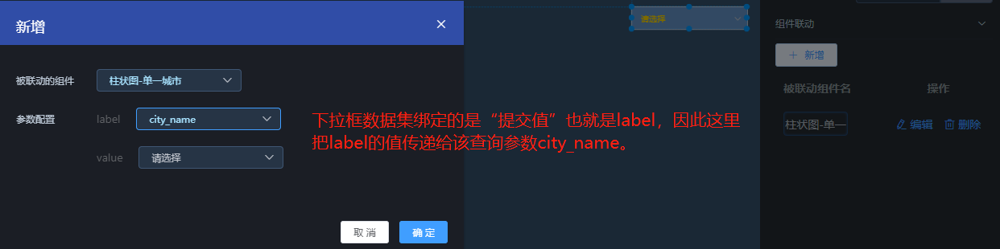  

  4、使用  
  注意内容看上面说明。 
  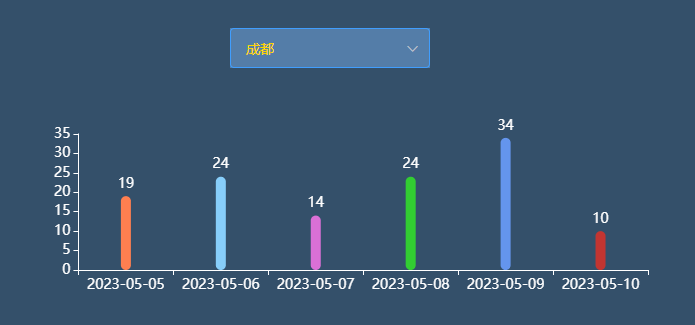  

### 时间筛选器

- 简介  
  时间筛选器组件底层定义了“startTime、endTime”字典值，即开始时间、结束时间，和下拉框一样，使用时也是传值给绑定图表的查询参数。 

- 联动说明  
  和下拉框的操作是一样的，这里也是绑定查询参数。 
  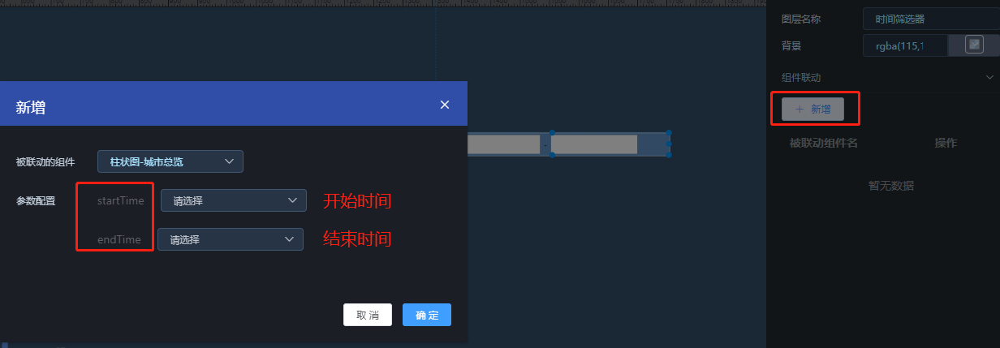  

- **注意事项！！！**  
  1、绑定的数据集的查询参数的时间格式，目前必须是 "yyyy-MM-dd HH:mm:ss"，其他日期格式，暂不支持。 
  2、绑定的数据集的查询参数至少有一个是和时间有关，最多两个和时间有关。 
  3、注意sql里面时间的比较，比如时间筛选器的今天是指当天的00:00:00 ~ 23:59:59 。 
  4、如果数据集的查询参数只有开始时间/结束时间其一，那么在用时间筛选器绑定的时候注意只绑定一个。 
  5、使用后的情况和下拉框使用后情况一致。 

- 数据集示例  
  查近7天。  
  startTime：DATE_FORMAT(DATE_SUB(NOW(),INTERVAL 7 DAY),'%Y-%m-%d')  
  endTime：now()  
  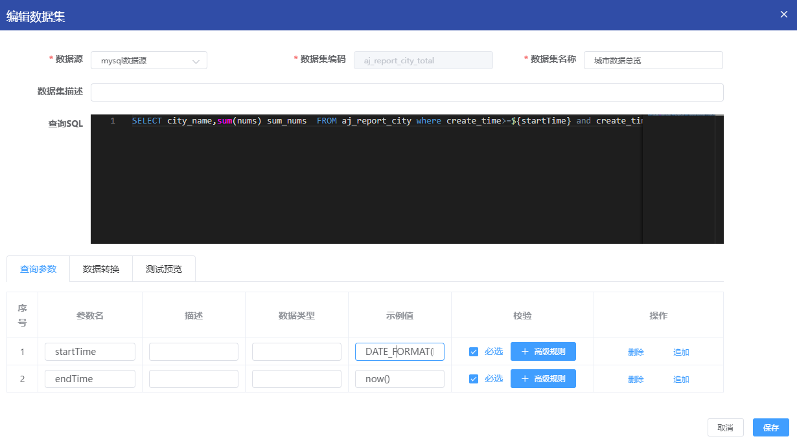  

## 图表联动

