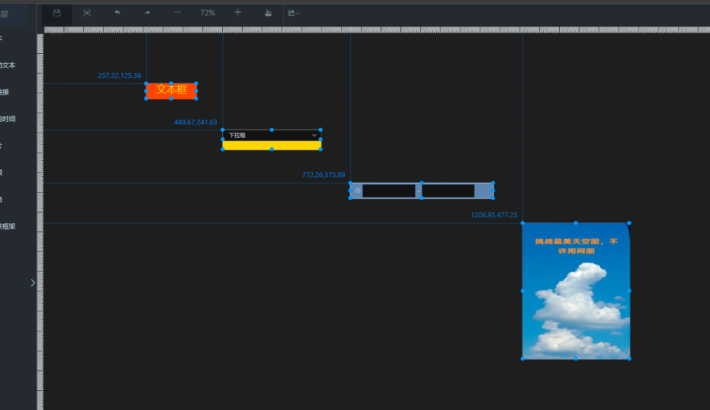
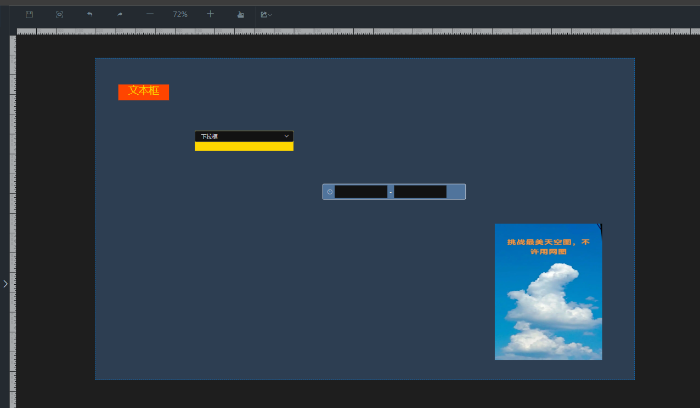
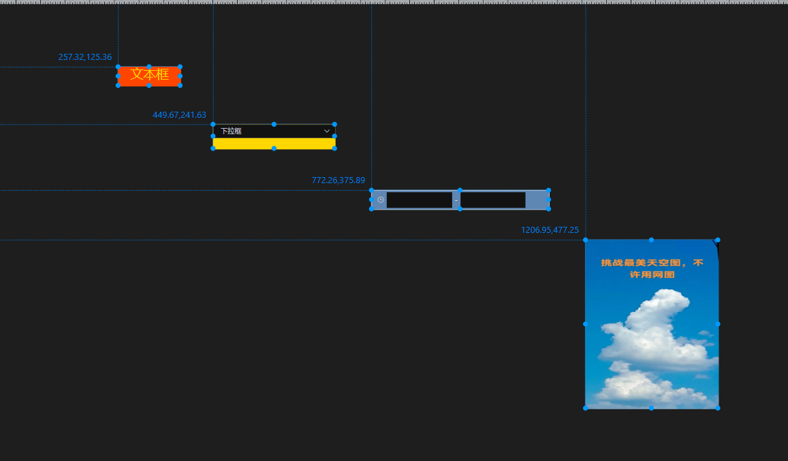
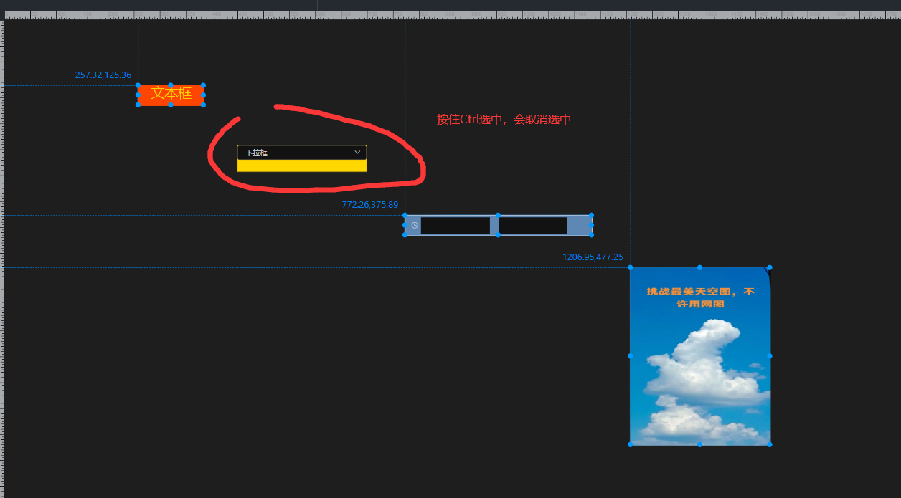
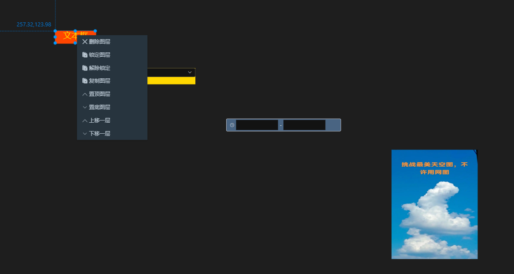
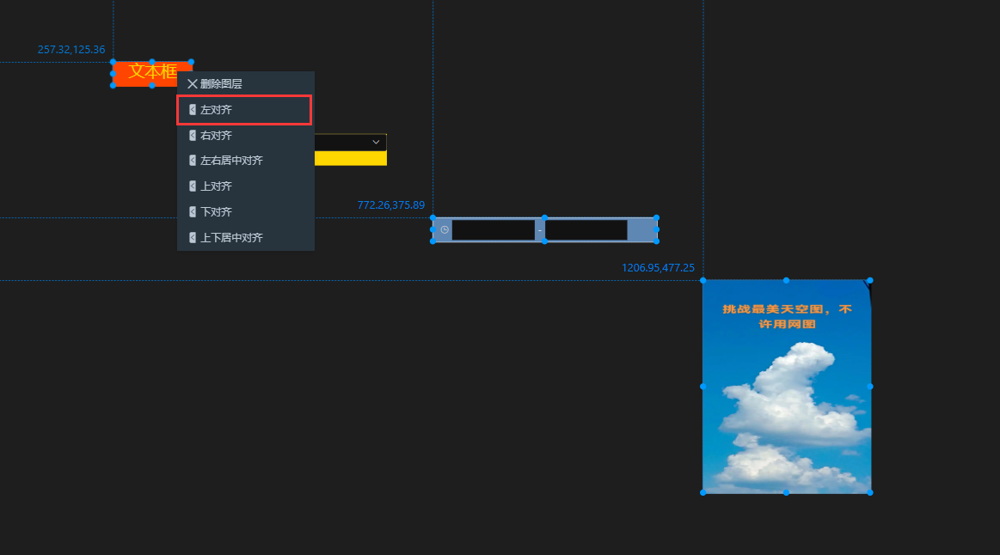
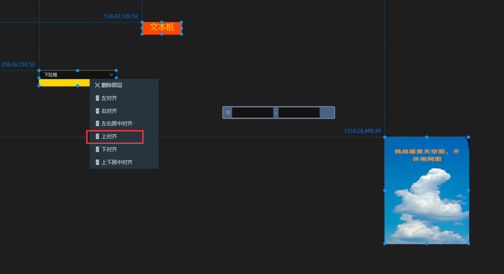
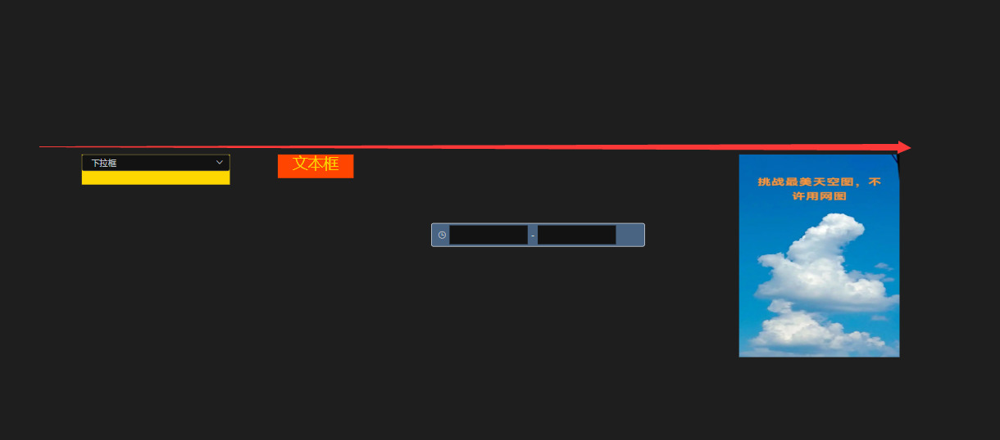
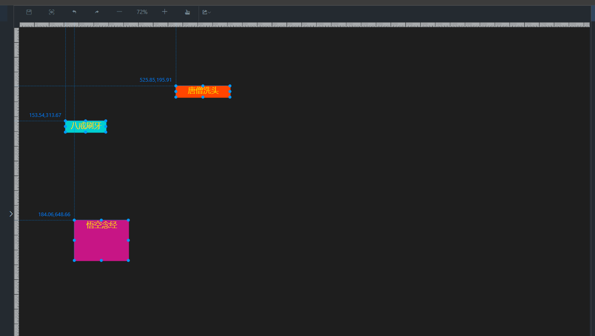
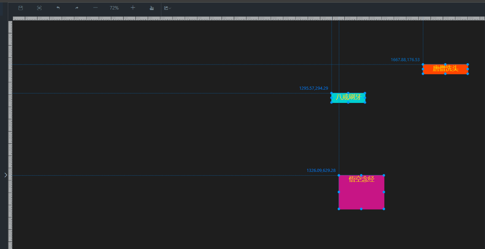

## 多组件对齐和拖拽移动功能

注意前端版本 vue版本

1.多组件选中实现
2.对齐实现
3.拖拽实现

### 1、多组件选中
1. Ctrl键
2. 鼠标框选
3. 组合

#### 方式1  Ctrl键实现多选
说明：

1. 第一次单击组件，会默认把选中的组件加入到已选中的组件集合中.
2. 按住Ctrl键选中的组件，会加入到已选中的组件集合中.
3. 按住Ctrl键选中的组件，如果已选中的组件中包含该组件，则该组件取消选中.
4. 点击大屏其他位置（非组件）,会把选中的组件清空.

测试截图：

#### 方式2  鼠标框选实现多选
说明：

1. 鼠标 （按下，移动，释放）生成矩形框，跟矩形框相交的组件会被选中.
2. 组合方式多选的情况下，框选之前已选中的组件不会加入（除非框选也有）.
3. 框选的组件，也支持按住Ctrl键取消选中.
4. 点击大屏其他位置（非组件）,会把选中的组件清空.

1. ​    鼠标按下，移动，释放，会生成一个矩形框，跟矩形框相交的组件爱你，会被选中.
2. ​    2.组合方式多选的情况下，框选之前已选中的组件不会加入（除非框选也有）.
3. ​    3.框选的组件，也支持按住Ctrl键取消选中.
4. ​    4.点击大屏其他位置（非组件）,会把选中的组件清空.

- ​    1.鼠标按下，移动，释放，会生成一个矩形框，跟矩形框相交的组件爱你，会被选中.

测试截图：

### 2、多组件对齐

单选右键菜单

多选右键菜单

#### 左对齐/右对齐/居中对齐

选择左对齐 （以最上边的组件为标准对齐）---不合适自己可以修改代码

#### 上对齐/下对齐/居中对齐

选择上对齐（以最左边的组件为标准对齐）----不合适自己可以修改代码

### 3、多组件移动拖拽

#### 多选状态

#### 拖拽后

