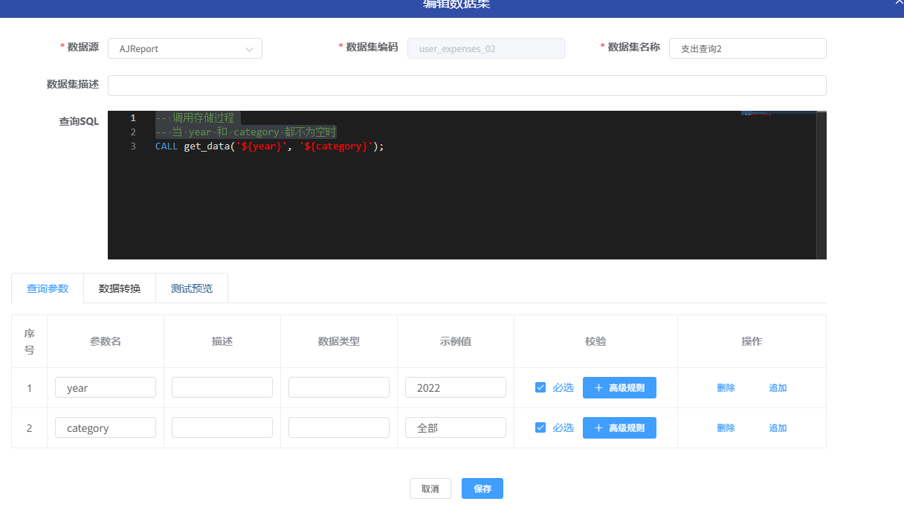

## 1.需求：
    多个下拉框联动一个图表，图表只查询最后一次选择的下拉框内容
    https://gitee.com/anji-plus/report/issues/IC2TFP

## 2.分析：
    
    由于目前设计的组件组件联动，都是在条件组件完成选择或者输入之后就直接触发联动了，
    针对多个条件组件共同作用同一个图表的情况下，用户可能想要在最后一个组件完成输入的情况下才会触发联动

    所以，设计一个按钮组件，在条件组件都输入完成的情况下，有按钮组件触发联动。
    
    图表组件所需要的参数均有按钮组件提供，而按钮组件的参数由条件组件（表单组件）传递，形成一个提交表单。

    按钮组件的数据集跟图表的数据集选择保持一致，即参数保持一直.

    ** 原先联动逻辑无需改变 **
    1.按钮组件 联动  图表组件;
    2.条件组件 联动  按钮组件;

## 3.设计示例：
#### 1.测试数据库表  test_user_expenses

```sql
create table test_user_expenses
(
    id       bigint auto_increment comment '主键'
        primary key,
    user     varchar(32) not null comment '用户',
    year     int         null comment '年份',
    rq       date        null comment '日期',
    category varchar(50) null comment '分类',
    expenses decimal     null comment '支出'
)
    comment '测试表' collate = utf8mb4_unicode_ci;
```
#### 2.测试数据
```sql
INSERT INTO test_user_expenses (id, category, expenses, year, user, rq)VALUES (1, '住房物业', 23460, 2023, 'jhh', '2023-04-01');
INSERT INTO test_user_expenses (id, category, expenses, year, user, rq)VALUES (2, '日用百货', 6496, 2023, 'jhh', '2023-04-15');
INSERT INTO test_user_expenses (id, category, expenses, year, user, rq)VALUES (3, '交通出行', 5592, 2023, 'jhh', '2023-05-01');
INSERT INTO test_user_expenses (id, category, expenses, year, user, rq)VALUES (4, '餐饮美食', 3218, 2023, 'jhh', '2023-06-01');
INSERT INTO test_user_expenses (id, category, expenses, year, user, rq)VALUES (5, '充值缴费', 1953, 2023, 'jhh', '2023-08-08');
INSERT INTO test_user_expenses (id, category, expenses, year, user, rq)VALUES (7, '其他', 1888, 2023, 'jhh', '2023-10-01');
INSERT INTO test_user_expenses (id, category, expenses, year, user, rq)VALUES (8, '住房物业', 23550, 2022, 'jhh', '2022-04-01');
INSERT INTO test_user_expenses (id, category, expenses, year, user, rq)VALUES (9, '日用百货', 2846, 2022, 'jhh', '2022-04-15');
INSERT INTO test_user_expenses (id, category, expenses, year, user, rq)VALUES (10, '交通出行', 2108, 2022, 'jhh', '2022-05-01');
INSERT INTO test_user_expenses (id, category, expenses, year, user, rq)VALUES (11, '餐饮美食', 2634, 2022, 'jhh', '2022-06-01');
INSERT INTO test_user_expenses (id, category, expenses, year, user, rq)VALUES (12, '充值缴费', 5280, 2022, 'jhh', '2022-08-08');
INSERT INTO test_user_expenses (id, category, expenses, year, user, rq)VALUES (13, '其他', 11553, 2022, 'jhh', '2022-10-01');
INSERT INTO test_user_expenses (id, category, expenses, year, user, rq)VALUES (14, '住房物业', 40000, 2024, 'jhh', '2024-04-01');
INSERT INTO test_user_expenses (id, category, expenses, year, user, rq)VALUES (15, '日用百货', 5000, 2024, 'jhh', '2024-04-15');
INSERT INTO test_user_expenses (id, category, expenses, year, user, rq)VALUES (16, '交通出行', 3000, 2024, 'jhh', '2024-05-01');
INSERT INTO test_user_expenses (id, category, expenses, year, user, rq)VALUES (17, '餐饮美食', 3000, 2024, 'jhh', '2024-06-01');
INSERT INTO test_user_expenses (id, category, expenses, year, user, rq)VALUES (18, '充值缴费', 5000, 2024, 'jhh', '2024-08-08');
INSERT INTO test_user_expenses (id, category, expenses, year, user, rq)VALUES (19, '其他', 10000, 2024, 'jhh', '2024-10-01');
```

#### 3.测试用的存储过程
```sql
create
    definer = root@localhost procedure get_data(IN p_year varchar(255), IN p_category varchar(255))
BEGIN
    SET @sql = 'SELECT id, user, year,rq, category,expenses FROM test_user_expenses WHERE 1 = 1';

    IF p_year IS NOT NULL AND p_year != '' AND p_year != '全部' THEN
        SET @sql = CONCAT(@sql, ' AND year = "', p_year, '"');
    END IF;

    IF p_category IS NOT NULL AND p_category != '' AND p_category != '全部' THEN
        SET @sql = CONCAT(@sql, ' AND category = "', p_category, '"');
    END IF;

    PREPARE stmt FROM @sql;
    EXECUTE stmt;
    DEALLOCATE PREPARE stmt;
END;
```

#### 4.数据集
数据集设计


### 5.大屏设计


按钮组件


按钮配置


按钮联动图标

按钮联动图标参数信息


条件组件联动按钮


条件组件联动按钮参数信息


### 6.测试


### 7. 注意事项
    
    (1) http方式的数据集参数拼接的方式，不允许传递的参数为空，后端请求url解析后可能会带{}会报错，所以要求所有的条件输入都必须有值，不清楚最新不能把支不支持。
    (2) 建议增加默认联动开关，看需求自行二次修改。
    (3) 这里做了表单校验，如果存在未输入的，点击按钮会提示，提示语信息，有开发能力的自行增加配置信息。


