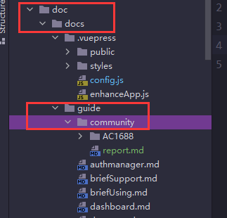
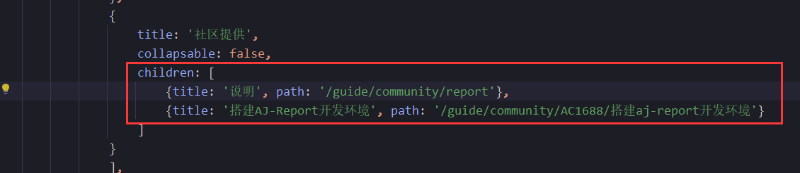

# 社区用户提交文档PR的简易说明

## 提交位置
doc -- > docs --> guide -- > community 目录  
  

## 具体操作
- 请在community目录下新建属于你自己的文件目录，命名方式可以使用自己在gitee的名字作为命名，注意中文命名可能会存在的一些问题。 
- 在你的个人目录下，你可以新建MD文件，需要用到图片可以直接放一个目录，如果md多，图片也多，建议再建下级目录存放。 

最后别忘了在config.js中添加配置，如图示。 
  

