## 介绍
## 新增大屏
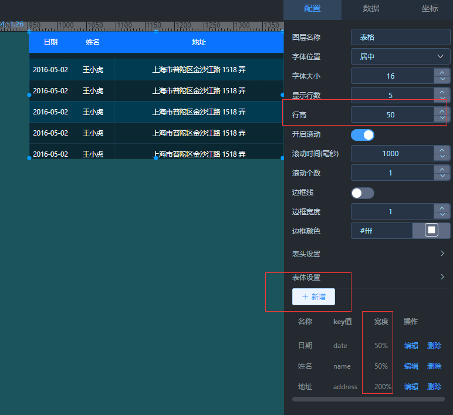

## 大屏简介

## 工具栏
### 文本框
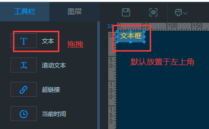
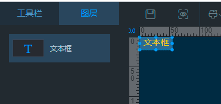

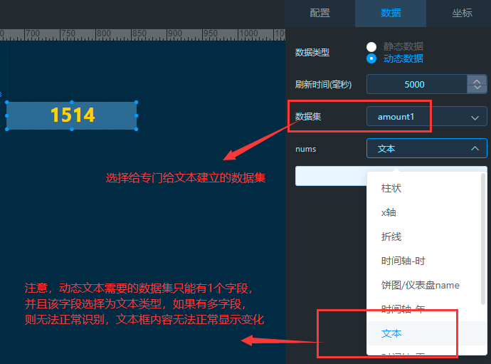

### 滚动文本
已支持动态数据，请参考文本框的操作  

### 超链接
**如有问题，请提交 [Issue](https://gitee.com/anji-plus/report/issues)  **

### 当前时间
已支持多种时间格式，其他格式请提Issue  
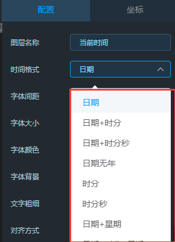

### 图片
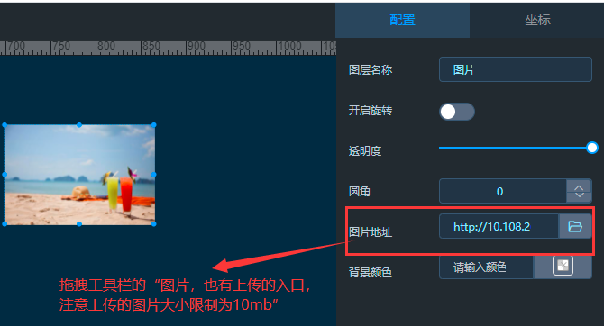

### 视屏
**暂不支持循环播放** 

### 内联框架
当超链接和视频链接无效的时候，请尝试使用内联框架 

### 表格
**存在问题，还在开发中** 

### 柱状图
目前**柱状图-渐变色**图形右侧功能区还在开发调整中  

### 柱状堆叠图
开发中  

### 折线图
**如有问题，请提交 [Issue](https://gitee.com/anji-plus/report/issues)  **
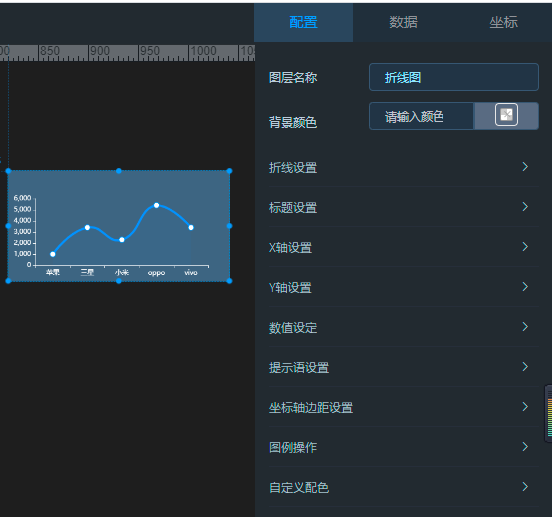

### 柱线图
**如有问题，请提交 [Issue](https://gitee.com/anji-plus/report/issues)  **
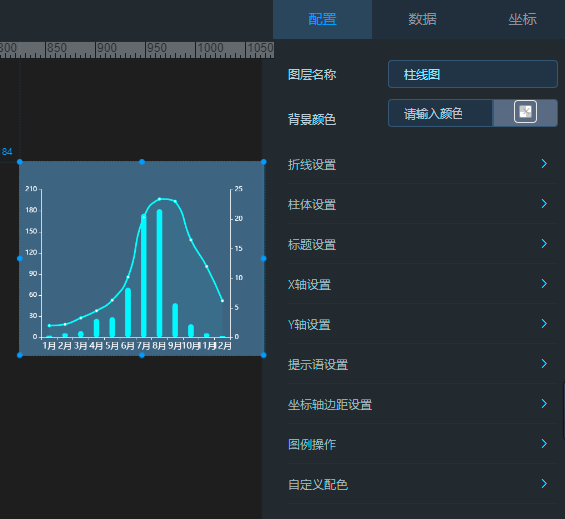

### 饼图
**如有问题，请提交 [Issue](https://gitee.com/anji-plus/report/issues)  **
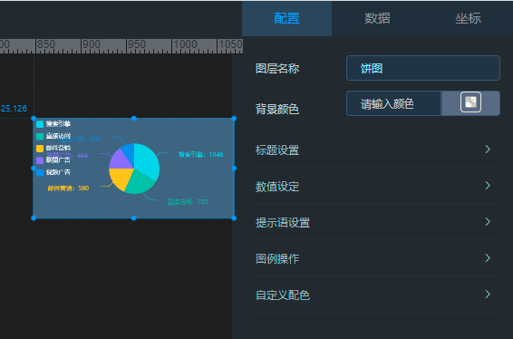  
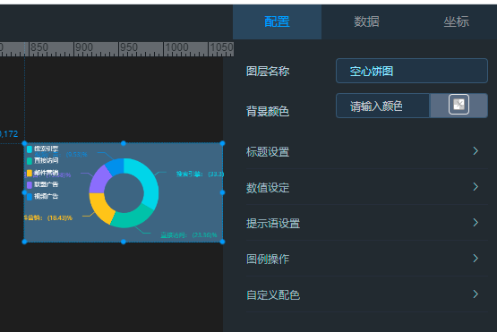  
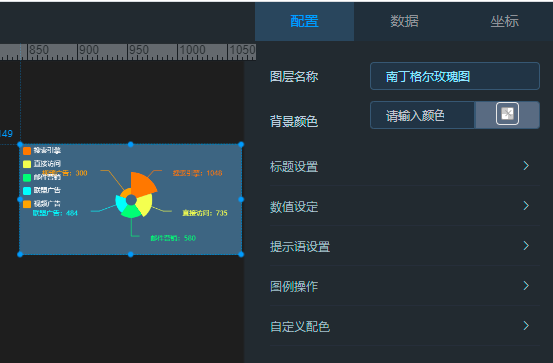  

### 漏斗图
**如有问题，请提交 [Issue](https://gitee.com/anji-plus/report/issues)  **
  

### 仪表盘
**如有问题，请提交 [Issue](https://gitee.com/anji-plus/report/issues)  **
  

### 中国地图
**注**：气泡地图已支持动态数据，中国地图（迁徙图）暂不支持动态数据
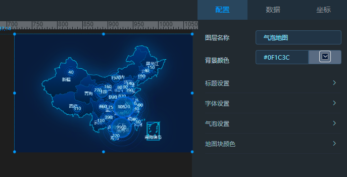  

### 百分百图
**如有问题，请提交 [Issue](https://gitee.com/anji-plus/report/issues)  **
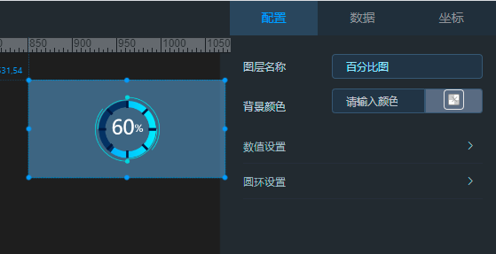  

### 热力图
**开发中**  

### 对比图
**开发中**  
