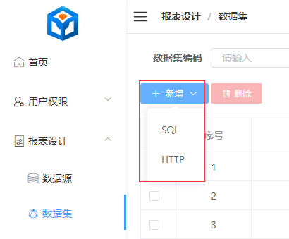
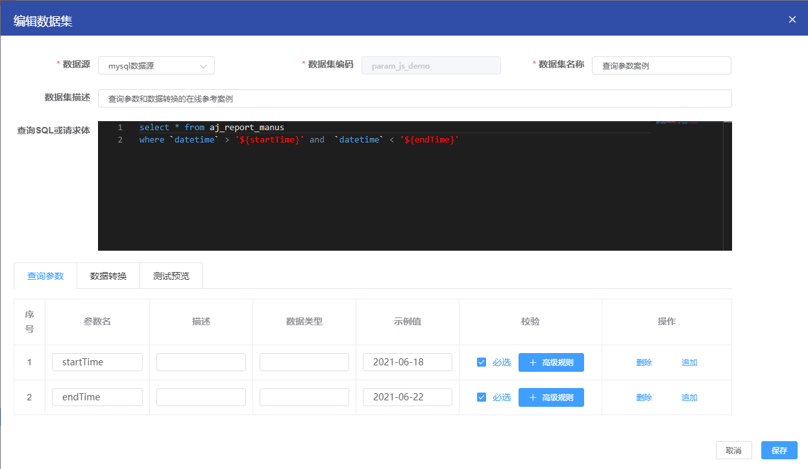
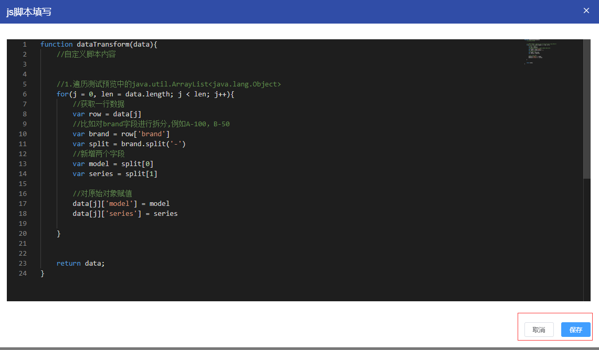
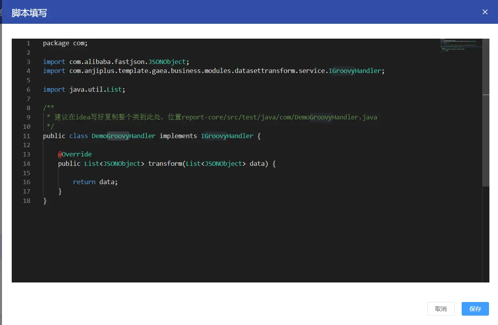
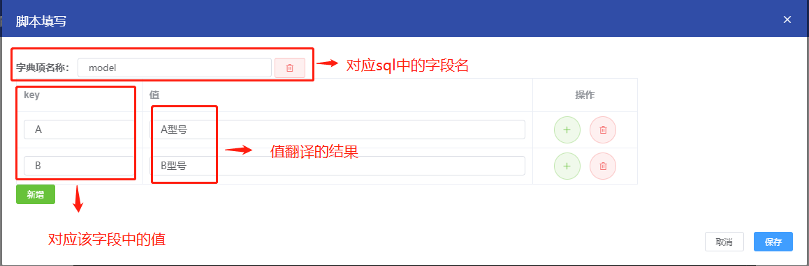

## 简介

根据选中的数据源＋查询 sql 或请求体完成数据的查询。<br>
 <br>

[数据源数据集用法总结](https://my.oschina.net/u/4517014/blog/5270828) <br>

## SQL数据集

尽量不要使用 “select *”，以及展示很大的数据量，图表不一定能展示、页面可能会卡死。 <br>

### Mysql数据集

在数据源处添加了mysql的数据源后，即可使用。<br>
 <br>

### ES数据集

**注**：es是通过调用xpack-sql，注意写法，数据源亦有说明。 <br>
 <br>

### Kudu数据集

 <br>

## HTTP数据集

即原有Http数据源的功能，请注意：Http接口返回类型必须是Json、不能是text，text无法解析。 <br>
支持请求路径和请求头中存在动态数据，采用 ${} 方式进行动态替换，具体看下面查询参数的相关说明。 <br>
 <br>

## 功能栏

**可以看在线环境，有示例参考** <br>

### 查询参数

[数据源数据集用法总结](https://my.oschina.net/u/4517014/blog/5270828) <br>

注意参数名要和sql(请求体)中变量名保持一致，sql(请求体)中的变量用 ${} 表示。 <br>
 <br>
如图所示，查询 sql 中，定义了两个变量，startTime 和 endTime。那需要我们在查询参数中添加对应的两个参数。 参数名保持和查询 sql
中 ${param} 保持一致。<br>
数据类型可以不填，暂时未用到。

#### 数据类型

暂时无用，写了也不生效，目前统一都是string处理。 <br>

#### 高级规则

自定义JS，这里的JS是java的scriptengine执行的，支持ES5的写法。

- 示例一 <br>
  返回yyyyy-MM-dd类型的当前时间

```js
// 返回yyyyy-MM-dd类型的当前时间
function verification(data) {
    //自定义脚本内容
    //获取当前时间
    var date = new Date();
    var year = date.getFullYear();
    var month = date.getMonth() + 1;
    var day = date.getDate();
    if (month < 10) {
        month = "0" + month;
    }
    if (day < 10) {
        day = "0" + day;
    }
    var nowDate = year + "-" + month + "-" + day;
    return nowDate;
}
```

- 示例二 <br>
  不传参则查询全部

```sql
// sql可以这么写
SELECT DATE_FORMAT(create_time, '%Y-%m-%d') create_time, sum(nums) sum_nums
FROM aj_report_city ${city_name}
group by create_time;
```

```js
// 不传参则查询全部
function verification(data) {
    // 获取示例值
    data = data.sampleItem;
    if (data == null || data == '') {
        return ''
    }
    data = 'where city_name = "' + data + '" '
    return data;
}
```

**注：** 当前V1.0.0版本示例值是不可为空的，所以实际使用可能会麻烦点

### 数据转换

数据转换是在执行完 sql 之后进行的数据清洗操作。

#### js脚本

 <br>
入参是data，返回值也必须是data，中间是JS的处理过程，注意入参返回都是``List<JSONObject>``

```js
// 根据sql查询出的结果进行数据清洗
function dataTransform(data) {
    //自定义脚本内容

    //1.遍历测试预览中的java.util.ArrayList<java.lang.Object>
    for (j = 0, len = data.length; j < len; j++) {
        //获取一行数据
        var row = data[j]
        //比如对brand字段进行拆分,例如A-100，B-50
        var brand = row['brand']
        var split = brand.split('-')
        //新增两个字段
        var model = split[0]
        var series = split[1]

        //对原始对象赋值
        data[j]['model'] = model
        data[j]['series'] = series

    }
    return data;
}
```

#### java脚本

通过Groovy来进行实现的，[Groovy用法参考](https://my.oschina.net/u/4517014/blog/5526324) <br>
如下图所示: <br>
建议在 idea 写好复制整个类到此处，位置 report-core/src/test/java/com/DemoGroovyHandler.java <br>
出入参皆为 ``List<JSONObject>`` data
 <br>

#### 字典项

针对查询结果某一项 key 值，做一个翻译。<br>
 <br>

### 数据预览

针对此次数据集，进行数据预览，尽量不要使用 select * from table <br>
