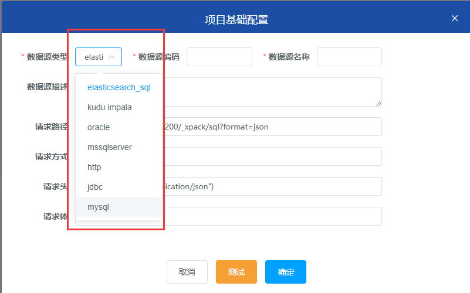
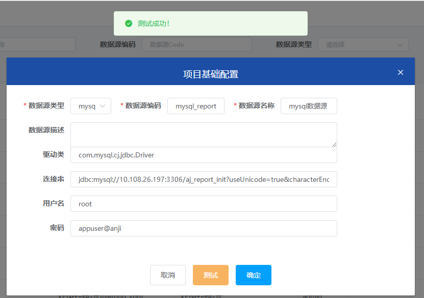
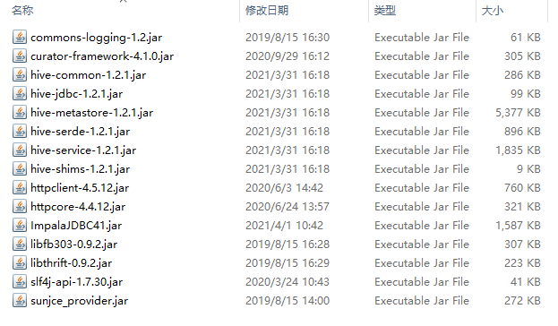

## 介绍
- 支持多数据源，内置mysql、elasticsearch、kudu等多种驱动 <br>
- 可动态扩展


## 数据源类型
- 没有找到新增数据源类型？<br>
```text
字典管理目前暂未有页面维护，可自行去数据库中增加你需要的数据源类型。
表aj_report.gaea_dict，字段dict_type：SOURCE_TYPE
表aj_report.gaea_dict_item, item_extend字段是下拉选择后动态表单渲染的json数据
```


## 操作
- 只有测试通过的数据源才可以保存



## 扩展
- 以kudu impala 为例，在lib文件夹下加入kudu impala相关的JDBC连接相关的包，如图在数据库中新增数据源类型，参考数据源类型(上方)




  
  
