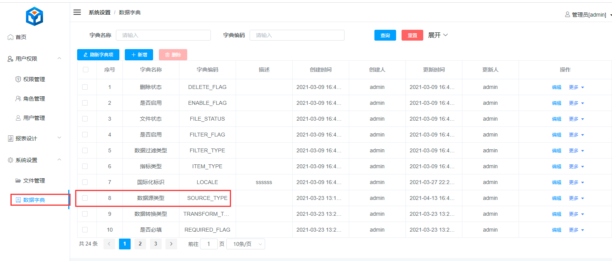
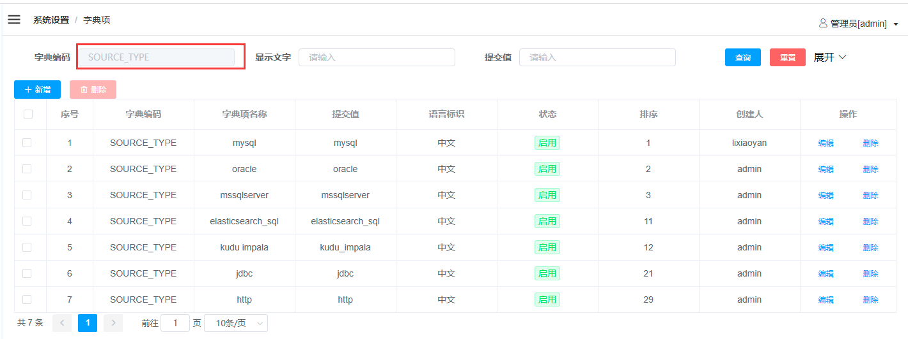
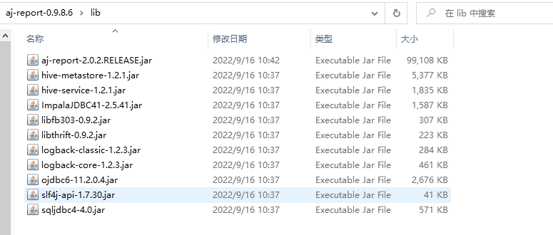
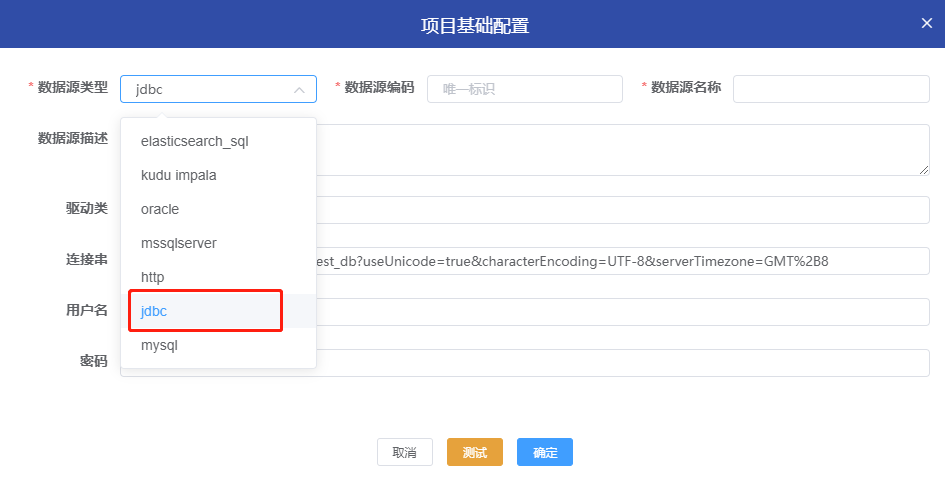

## 介绍

[数据源数据集用法总结](https://my.oschina.net/u/4517014/blog/5270828) <br>

- 支持多数据源，内置mysql、elasticsearch、kudu等多种驱动 <br>
- 可动态扩展
  

## 数据源类型

查看已有的数据源类型 <br>
  <br>
  <br>

```text
可以在此页面进行新增数据源配置，也可以去数据库中增加你需要的数据源类型。
表aj_report.gaea_dict_item，字段dict_code：SOURCE_TYPE
表aj_report.gaea_dict_item, item_extend字段是下拉选择后动态表单渲染的json数据
```

**注：** Http数据源功能已经移动到Http数据集中，原功能不变，有Http接口数据请直接使用Http数据集，请注意Http接口数据返回格式必须是Json

## 操作

- 只有测试通过的数据源才可以保存
  

## 扩展

### JDBC驱动类数据源添加

##### 发行版

```text
1、将jar包上传到 "aj-report.xxx/lib"目录下
2、启动项目(重启项目)
3、前端页面数据源类型选择"jdbc"，填上对应的驱动类、连接串、用户名密码
```

 <br>
 <br>

##### 源码

源码推荐使用第二种方式。<br>

- 第一种，在report-core/lib目录下添加 <br>
  按照同样的层级将驱动包放置，使用build.sh脚本进行打包，前端页面数据源类型选择"jdbc"
  ，填上对应的驱动类、连接串、用户名密码。<br>
  **注意：** 此方式添加的jar包只能使用build.sh进行编译后才会生效。<br>

<br>

- 第二种，在pom.xml中添加 <br>
  使用build.sh脚本编译或者maven package编译都可以，前端页面数据源类型选择"jdbc"
  ，填上对应的驱动类、连接串、用户名密码。<br>

<br>

### 非JDBC驱动类数据源添加

例如原生ES、Redis之类。<br>

```text
1、在源码中编写解析代码(datasource)
2、生成数据字典，可在数据字典页面找到"数据源类型"，在"操作"栏中选择"编辑字典项"
3、添加对应驱动包
```
  
  
