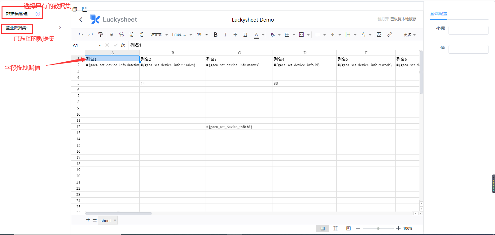
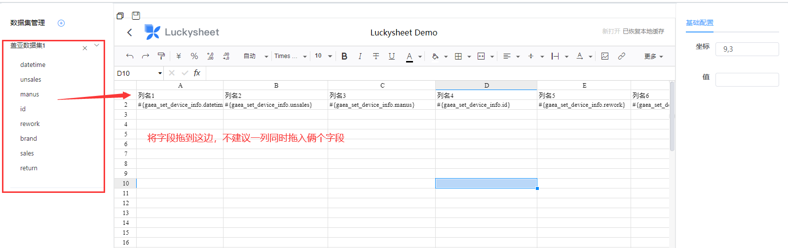
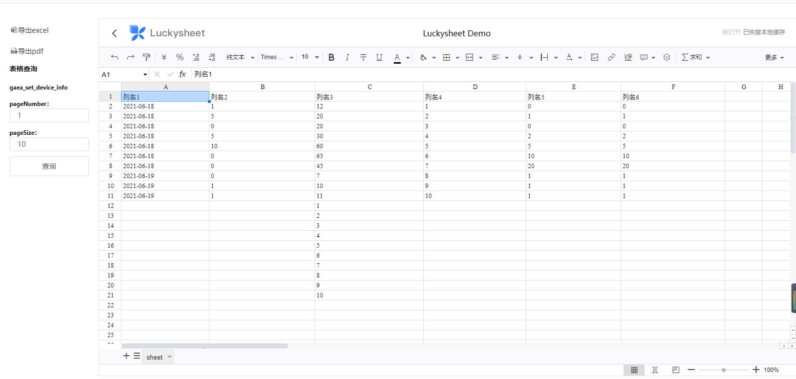

# 介绍

Excel报表基于Luckysheet开发，[Luckysheet](https://gitee.com/mengshukeji/Luckysheet) 一款纯前端类似excel的在线表格，功能强大、配置简单、完全开源。
**注意：** Excel报表目前只是简单集成，如果你遇到了一些问题请在此[Issue](https://gitee.com/anji-plus/report/issues/I4CEWV) 下面进行回复。 

## 表格报表设计

进入表格设计方法1：  
从报表管理模块选择需要设计的大屏，按图示进入大屏设计界面  
  

进入大屏设计方法2：  
从大屏报表模块选择需要设计的大屏，按图示进入大屏设计界面  
  

## 简介

  

## 使用

**注**：不建议一列中同时存在俩个字段数据，同时一列值也建议不要存到超大数据量，肯定无法显示的 
  

## 预览/保存

点击保存，则会将数据写入到库中。 
点击预览，则进入预览界面。 
  

## 预览界面

可以进行导出操作。 
  
