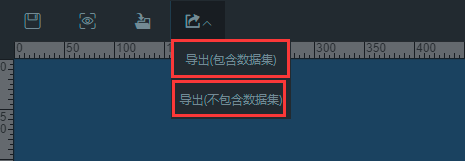
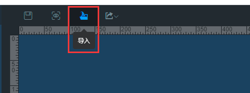

## 说明

导入导出快慢都是很正常的，不需要重复点击，没那么快就能处理完导入导出操作。 
使用导入导出，需要确定好自己是否在 bootstrap.yml 配置文件里面配置好了上传下载的地址，否则当有图片导入时会无法正常显示。 

## 导出

  
导出会生成zip文件，包含图表、样式、图片等，不会带有该大屏的名称和code。 

### 导出数据集

适用于同一系统内部使用。 
**注：**
作为导入的新系统必须也要有相同的数据集才可以正常显示，导出数据集并不是说将你当前大屏用到的数据集也一并导出了，仅是导出包含了动态数据等相关配置而已。 

### 导出不含有数据集

导出的图表会使用默认的静态数据集，适用于跨系统，请注意，如果你的大屏图表有部分图表是在对方系统不存在的，那么目前整个大屏是不会显示出来的，后续会进行兼容，不存在的图表留空。 

## 导入

  
选择一个导出的zip文件导入即可。注意，导入会覆盖当前大屏，请新建一个空白的大屏进行导入。 
**注：** 如果你导入的大屏中含有你当前系统不存在的图表，整个大屏是不会显示的。 

## 导入导出权限

请查看权限控制模块中关于导入导出权限的说明。  
