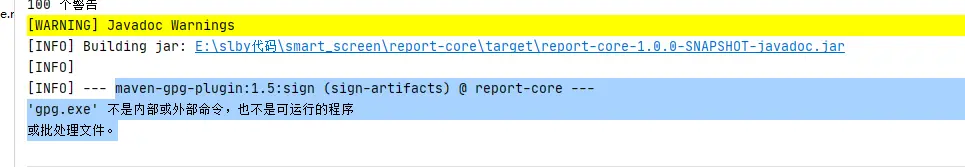

- 没有找到新增数据源类型？ 
  字典管理目前暂未有页面维护，可自行去数据库中增加你需要的数据源类型。 
  表aj_report.gaea_dict，字段dict_type：SOURCE_TYPE 
  表aj_report.gaea_dict_item, item_extend字段是下拉选择后动态表单渲染的json数据 
  

- 快速部署本地运行，提示“在线体验版本”  
  请下载最新源码或者最新发行版
  

- 使用Maven Install打包时报错  

  请使用Maven Package进行打包
  

- 底层数据库为Mysql8.0+时，flyway执行SQL报错 
  修改pom.xml依赖，添加Mysql8.0驱动包，将DB目录里面SQL文件utf8_general_ci字符集改成mysql8.0支持的字符集
  

- Jdk11无法启动

