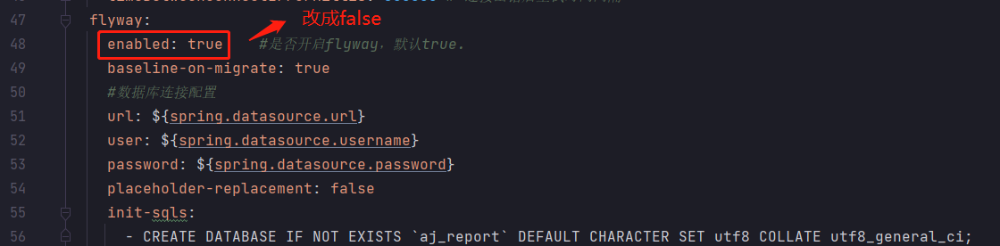
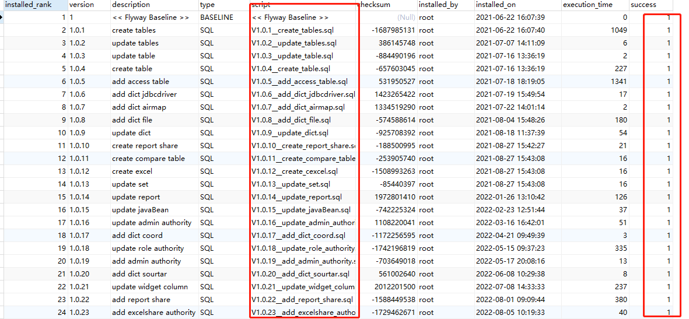
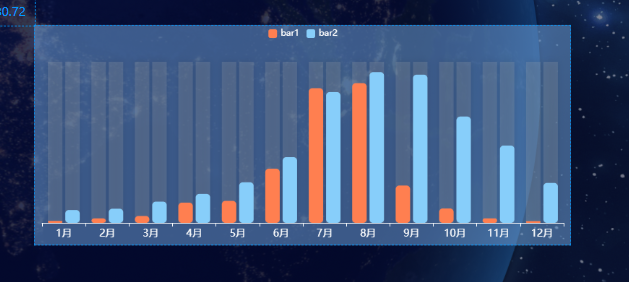
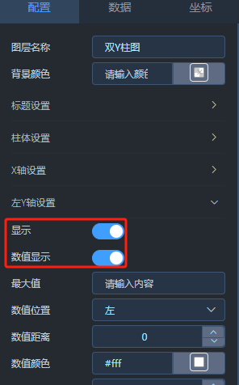
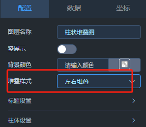
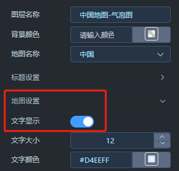

## 其他

- 禁用flyway及切换底层数据库方案  
  [链接](https://my.oschina.net/u/4517014/blog/5269319)  

- 数据源数据集用法总结  
  [链接](https://my.oschina.net/u/4517014/blog/5270828)  

- 使用Maven Install打包时报错  
    
  使用Maven Package进行打包  

 

## 版本Q&A

[开发环境参考](https://ajreport.beliefteam.cn/report-doc/guide/quicklyDevelop.html)

- 底层数据库为Mysql8.0+时，flyway执行SQL报错 
- Node.js是V16版本时 npm install失败  
- jdk使用1.7或者11及以上时，编译打包不过  
   
    

 

## 编译Q&A

- 前端npm install失败

  1、使用node -v检查你的node.js版本，不要使用Node.js16及以上版本。 
  2、使用npm get registry查看npm镜像源，将npm镜像设置为淘宝镜像源(百度查具体步骤)。 
  3、使用cnpm install命令替换npm install命令进行编译。 

 

- 执行源码编译脚本（build.sh）提示：“*** report-ui/dist/* *** No such file or directory”  
  前端编译失败。 

  大部分原因是Node.js版本过高（高于V14），导致前端编译失败(npm install失败)。  
  另一部分是Nodejs在编译执行初始化时会去下载一些依赖，如果依赖下载不下来，也会导致失败。 

 

- 执行源码编译脚本（build.sh）提示：“report-core/target/aj-report-*.zip *** No such file or directory”  
  后端编译失败。 

  可能原因有：Maven版本过低/过高，导致后端编译失败。可尝试重新执行编译脚本  

 

- 使用eclipse进行源码编译时失败  

  失败的提示有很多，这里建议换成IDEA   

 

- 使用IDEA进行源码编译时提示：“*** openjdk-***”  

  请使用jdk1.8  

 

## 启动Q&A

- 双击启动start.bat，提示：“xxx 不是内部或外部命令，也不是可运行的程序 xxx”  

  1、不要将文件放到一个带有空格的目录下  
  2、如果文件放在C盘，那么请注意权限  

 

- 日志提示“xxx The driver has not received any packets from the server”  
  驱动缺失或者对应数据库连接不上 

  1、确保软件打包正常  
  2、mysql版本不兼容，详细看上面关于版本兼容性  
  3、bootstrap.yml中配置的mysql地址ip不对  
  4、如果通过IDEA启动后端的话，几个bootstrap.yml配置文件的内容都要修改  

 

- flyway相关错误

错误提示：**Error creating bean with name 'flywayInitializer' defined in class XXX migration to version V1.0.XXX.sql
failed**  
解析：flyway在执行某个版本里面包含的sql时报错了  

可能原因： 
1、mysql版本问题，在不同版本的mysql中，部分语法可能存在异同  
2、mysql配置问题  

解决方案： 
一、禁用flyway，手动执行已有的各版本sql文件  
1、在bootstrap.yml配置文件中找到flyway配置项，如图示  
  
2、将report-core/src/main/resources/db.migration目录下所有的sql文件都执行一次，遇到报错，手动修改sql文件。 
3、sql文件中，只有** aj_report **数据库相关的sql是必须的依赖，在确保和aj_report数据库相关sql都执行后在启动服务。 

二、保持flyway开启状态，手动执行报错的那个版本sql文件  
1、在report-core/src/main/resources/db.migration目录下找到报错的那个版本sql  
2、根据报错提示找到sql文件中具体报错的那一段sql，或者和数据库已有的数据对比，找到没有执行成功的那部分sql  
3、手动执行flyway没执行成功的那部分，根据提示，对sql进行修改调整  
4、执行完毕后，在aj_report数据库下flyway_schema_history表中找到报错对应的sql文件版本，将对应的success改完1  
  

## 访问Q&A

- 浏览器兼容性   

  当前未对部分浏览器做兼容性适配，推荐使用谷歌浏览器进行访问。 
  已知：IE白屏、部分版本的火狐浏览器拖动组件出现跳转新页面及无法返回的情况  

 

- 部署完进入系统，点击预览大屏，大屏提示：“执行sql失败“  

    
  根据图示，将mysql数据源的账号密码修改为你当前系统的账号密码。 

 

- 页面提示“404”  

  1、确保访问地址无误，根据部署方式的不同 9095/9528 端口皆可以进入项目，如果一个不行试另一个端口  
  2、确定前端(端口号9528)是否启动  
  3、确定后端(端口号9095)是否启动  
  4、如果你是前后端分离部署，看看你前端config配置文件中的BASE_API有没有改成你后端的IP端口  
  5、使用nginx转发遇到问题也是同上  

 

## 数据集Q&A

## 大屏图表组件Q&A

- 访问大屏，发现图表X轴、Y轴等显示不出来，但数值、柱子、折线等又能显示  

  原因：每个图表，比如X轴、Y轴颜色默认就是白色，当背景色也设置为白色时，就无法显示，其他同理。 

 

## 1.2升级V1.3.0

V1.3.0为多张图表新增了配置项，有部分配置项直接和图表渲染相关联，当旧版本升级至此版本后会有部分图表不能正常显示，可参考以下内容进行调整。 
以下方式本质上都是重新载入新图表的配置，对于没提到的图表也可按照相同的方式尝试处理。 
如果按以下等方式对图表进行编辑仍不能正常显示图表，建议删了旧图表从新配置。 

- X轴，Y轴不显示-柱体，折线图等含有Y轴配置的的图表  
    
  解决方案： 
  打开Y轴配置项，左Y轴，右Y轴都可以，按图切换“显示”按钮，直到图表Y轴显示，X轴同理。 
  

   

- 柱状图柱子不显示，或整个图表空白  
    
  解决方案： 
  打开柱体设置，找到“间距”，来回拖动，默认间距值：10。 
  

   

- 饼图图不显示  
  如图示，整个图表空白。 
    
  解决方案： 
  打开饼图设置，拖动"内半径"或者"外半径"。 
  

   

- 堆叠图图不显示  
  解决方案： 
  选择堆叠样式，进行切换.  
  

   

- 地图图不显示  
  解决方案： 
  打开地图设置，切换文字显示。 
  

   

  如果你的图表配了动态数据，在尝试了上面这些配置修改后依旧没显示图表，手动切到动态数据，点击‘刷新’。 

