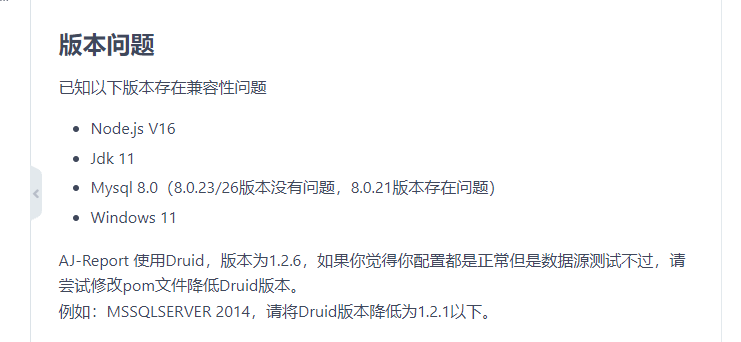
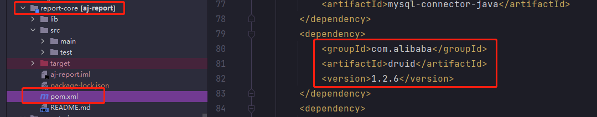

- 使用Maven Install打包时报错  
    
  请使用Maven Package进行打包  

### 版本问题：[开发环境参考](https://report.anji-plus.com/report-doc/guide/quicklyDevelop.html)

- 底层数据库为Mysql8.0+时，flyway执行SQL报错 
- Node.js是V16版本时 npm install失败  
- jdk使用1.7或者11及以上时，编译打包不过  
    

- MssSqlServer 2014及其上下版本数据源测试不过。以2014版本为例。  
    
  将1.2.6改成1.2.0  

- 浏览器兼容性 当前未对部分浏览器做兼容性适配，推荐使用谷歌浏览器进行访问。 

- 部署完进入系统，点击预览大屏，大屏提示：“执行sql失败“  
    
  请先重置mysql数据源，将mysql数据源的账号密码修改为你当前系统的账号密码。 

- flyway执行报错1.0.10sql失败  
  错误提示：Caused by: org.flywaydb.core.api.FlywayException: Validate failed: Detected failed  
  migration to version 1.0.10 (create report share)  
  请参考此 [Issue](https://gitee.com/anji-plus/report/issues/I47JNE) 解决此问题  

- 禁用flyway及切换底层数据库方案  
  [链接](https://my.oschina.net/u/4517014/blog/5269319)  

- 数据源数据集用法总结  
  [链接](https://my.oschina.net/u/4517014/blog/5270828)  

### 执行源码编译脚本（build.sh）报错

- 提示：“*** report-ui/dist/* *** No such file or directory”  
  前端编译失败。 
  99%的原因是Node.js版本过高（高于14），导致前端编译失败，Nodejs在编译执行初始化时会去下载一些依赖，如果依赖下载不来，也会导致失败。 
  剩下极少数情况可能是你编译的linux系统问题。 

- 提示：“report-core/target/aj-report-*.zip *** No such file or directory”  
  后端编译失败。 
  可能原因有：Mvn版本过低/过高，导致后端编译失败  

- 使用eclipse进行源码编译时失败  
  失败的提示有很多，这里建议换成IDEA   

- 使用IDEA进行源码编译时提示：“*** openjdk-***”  
  请使用jdk1.8

### 启动服务报错

- 提示“xxx The driver has not received any packets from the server”  
  连不上mysql。 
  1、确保软件打包正常  
  2、mysql版本不兼容，详细看上面关于版本兼容性  
  3、bootstrap.yml中配置的mysql地址ip不对  

- 提示“404”  
  1、确保访问地址无误，根据部署方式的不同9095/9528 端口皆可以进入项目，如果一个不行试另一个端口  
  2、确定前端是否启动  
  3、确定后端是否启动 br>

