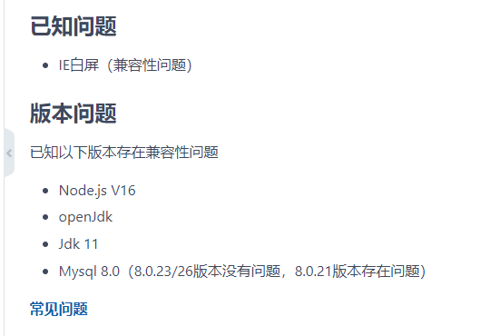
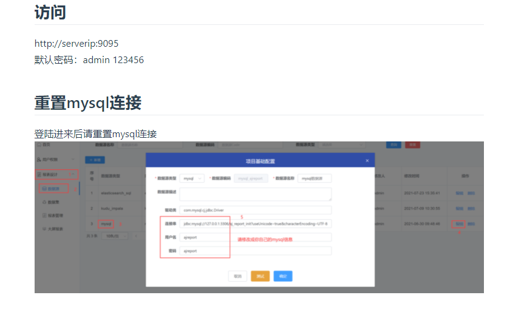

## 其他

- 禁用flyway及切换底层数据库方案  
  [链接](https://my.oschina.net/u/4517014/blog/5269319)  

- 数据源数据集用法总结  
  [链接](https://my.oschina.net/u/4517014/blog/5270828)  

- 使用Maven Install打包时报错  
    
  使用Maven Package进行打包  

 

## 版本问题：[开发环境参考](https://ajreport.beliefteam.cn/report-doc/guide/quicklyDevelop.html)

- 底层数据库为Mysql8.0+时，flyway执行SQL报错 
- Node.js是V16版本时 npm install失败  
- jdk使用1.7或者11及以上时，编译打包不过  
   
    

 

## 访问相关

- 浏览器兼容性   
  当前未对部分浏览器做兼容性适配，推荐使用谷歌浏览器进行访问。 
  已知：IE白屏、部分版本的火狐浏览器拖动组件出现跳转新页面及无法返回的情况  

 

- 部署完进入系统，点击预览大屏，大屏提示：“执行sql失败“  
    
  请先重置mysql数据源，将mysql数据源的账号密码修改为你当前系统的账号密码。 

 

- 页面提示“404”  
  1、确保访问地址无误，根据部署方式的不同 9095/9528 端口皆可以进入项目，如果一个不行试另一个端口  
  2、确定前端是否启动  
  3、确定后端是否启动  
  4、如果你是前后端分离部署，看看你前端config配置文件中的BASE_API有没有改成你后端的IP端口  
  5、使用nginx转发遇到问题也是同上  

 

## 执行源码编译脚本（build.sh）报错

- 提示：“*** report-ui/dist/* *** No such file or directory”  
  前端编译失败。 
  大部分原因是Node.js版本过高（高于V14），导致前端编译失败。  
  另一部分是Nodejs在编译执行初始化时会去下载一些依赖，如果依赖下载不下来，也会导致失败。 

 

- 提示：“report-core/target/aj-report-*.zip *** No such file or directory”  
  后端编译失败。 
  可能原因有：Maven版本过低/过高，导致后端编译失败  

 

- 使用eclipse进行源码编译时失败  
  失败的提示有很多，这里建议换成IDEA   

 

- 使用IDEA进行源码编译时提示：“*** openjdk-***”  
  请使用jdk1.8

 

## 启动服务相关

- 提示“xxx The driver has not received any packets from the server”  
  连不上mysql。 
  1、确保软件打包正常  
  2、mysql版本不兼容，详细看上面关于版本兼容性  
  3、bootstrap.yml中配置的mysql地址ip不对  

 

- flyway执行报错1.0.10sql失败  
  错误提示：Caused by: org.flywaydb.core.api.FlywayException: Validate failed: Detected failed  
  migration to version 1.0.10 (create report share)  
  请参考此 [Issue](https://gitee.com/anji-plus/report/issues/I47JNE) 解决此问题  

 

## 数据集相关

- 系统异常，后台日志显示“** Data too long for colum ** ”  
  1、建议不要使用 "select *"   
  2、一张图表能承载的数据量是有限的，太多则图表展示不出来、页面卡死等  
  3、必须使用 "select *" ，或者展示很多数据。解决方法，将测试预览的值删掉只剩一条，注意数据的结构 [{}]  

## 大屏图表组件相关

- 访问白屏  
  设计完大屏，保存后进行预览，发现背景全白  
  1、回到编辑页面，查看大屏背景颜色是否设置  
  2、查看大屏的宽高，如果宽高都是0（大屏宽高在设计时，有概率性变成0，不知原因）大屏背景图片，颜色，皆无法显示  
  3、大屏宽高改成 1920 1080  

 

- 文本框颜色无法改变  
  使用文本框，改变颜色，无法改变。已知有概率性的出现无法修改文本框颜色的情况。解决方法有以下  
  1、保存退出大屏，重新进入大屏修改文本框颜色  
  2、删掉文本框，重新拖动一个  

