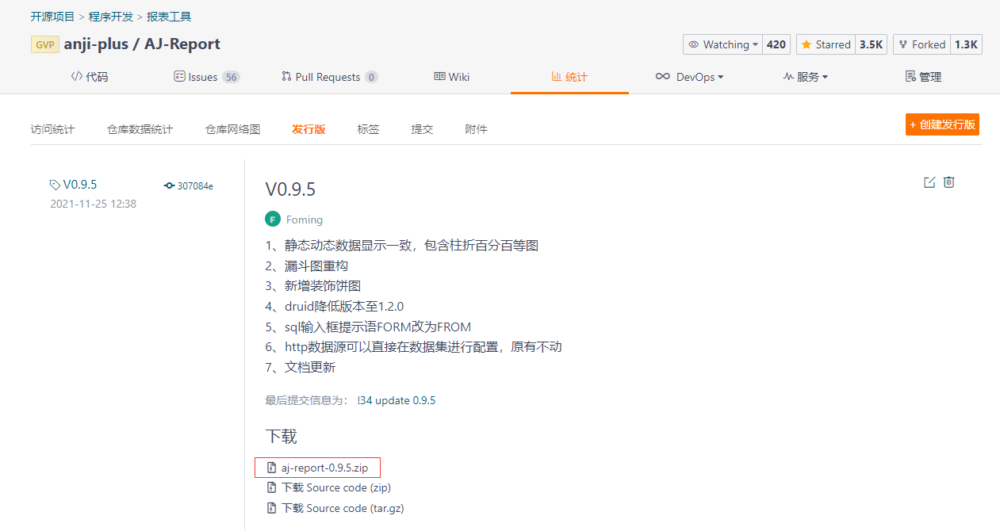
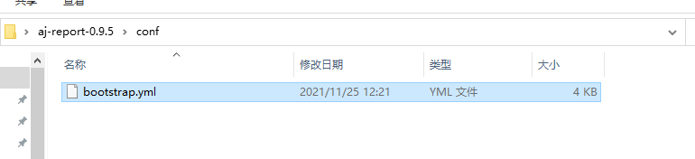
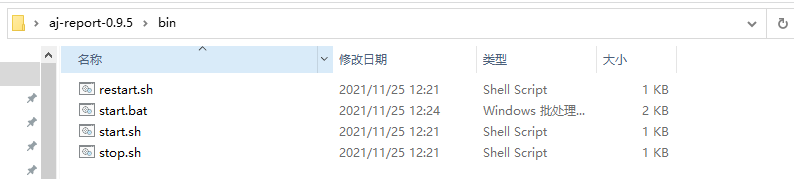

```
 第一步，下载zip包，解压
 第二步，conf->bootstrap.yml，修改数据库连接、上传下载地址等信息
 第三步，启动bin目录下start.sh
 第四步，访问 http://localhost:9095  admin 123456
```

## 版本问题

已知以下版本存在兼容性问题，请不要使用

- Node.js V16及以上
- openJdk
- Jdk 1.7及以下/11及以上（jdk11部分版本有问题）
- Mysql 8.0（8.0.23/26版本没有问题，8.0.21版本存在问题）

## 下载发行版

[下载地址](https://gitee.com/anji-plus/report/releases) ：https://gitee.com/anji-plus/report/releases <br>
 <br>

## 修改mysql连接

解压下载好的Zip包，找到bootstrap.yml <br>
 <br>

将图中关于mysql的连接配置信息换成你使用的IP <br>
**注**：aj_report库是存放底层基础信息的库，flyway启动时会自动建立，如果你在这里修改了库，将会出错 <br>

 <br>
**注**：请确认你的Mysql是否支持远程连接，登陆用户是否有DDL权限 <br>

## OSS配置

OSS底层已支持minio、amazonS3、nfs，都配置的情况下优先级minio->amazonS3->nfs <br>
 <br>

## 启动

linux启动：<br>
aj-report-XXX --> bin -->sh start.sh <br>

windows启动：<br>
aj-report-XXX --> bin --> start.bat <br>

 <br>

如果start.bat启动有问题的话，可以尝试以下方法解决。<br>
修改第4行的JAVA_HOME，改成你自己的JAVA_HOME，并去掉**rem**注释，双击启动<br>


## 访问

http://localhost:9095 <br>
默认密码：admin 123456 <br> 


