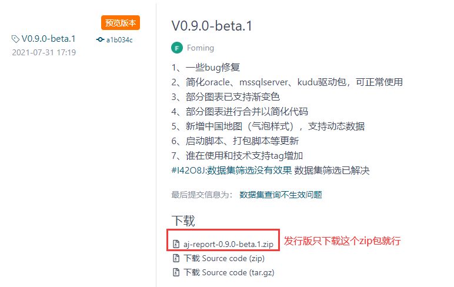
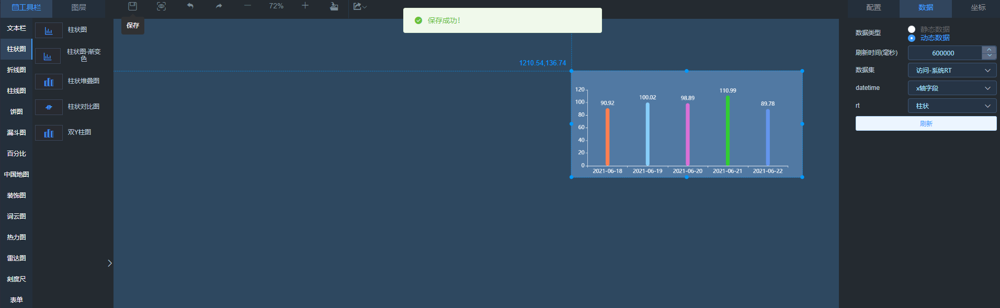
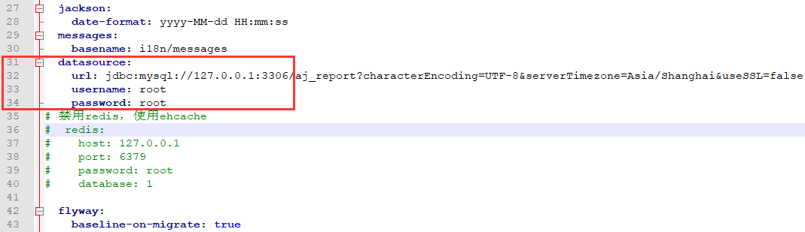
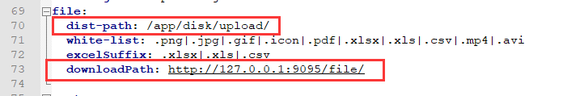
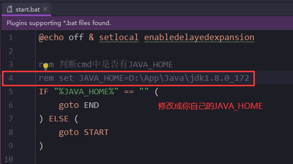
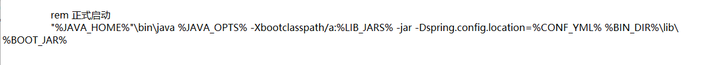
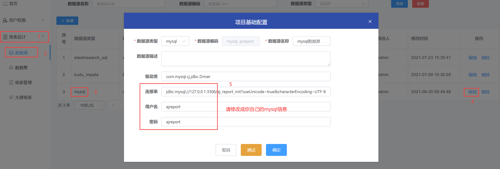

```
 第一步，下载zip包，解压<br>
 第二步，conf->bootstrap-dev.yml，修改mysql连接<br>
 第三步，启动bin目录下start.sh<br>
 第四步，访问 http://localhost:9095
```

## 下载发行版
下载地址：[https://gitee.com/anji-plus/report/releases](https://gitee.com/anji-plus/report/releases)


## 修改mysql连接
解压下载好的Zip包，找到bootstrap-dev.yml <br>
report-core-XXX --> conf --> bootstrap-dev.yml <br>


将图中关于mysql的连接配置信息换成你使用的IP <br>
**注**：aj_report库是存放底层基础信息的库，flyway启动时会自动建立，如果你在这里修改了库，将会出错<br>

 <br>
**注**：请确认你的Mysql是否支持远程连接，登陆用户是否有DDL权限

## 修改路径
使用上传功能，必须修改此内容


## 启动
linux启动：<br>
report-core-XXX --> bin -->sh start.sh <br>

windows启动：<br>
report-core-XXX --> bin --> start.bat <br>
修改第4行的JAVA_HOME，改成你自己的JAVA_HOME，并去掉**rem**注释，双击启动<br>
 <br>
**注**：如果你JAVA_HOME目录存在空格，将bat文件最下面的JAVA_HOME添加""号



## 访问
http://localhost:9095 <br>
默认密码：admin 123456

## 重置mysql连接
登陆进来后请重置mysql连接 <br>



