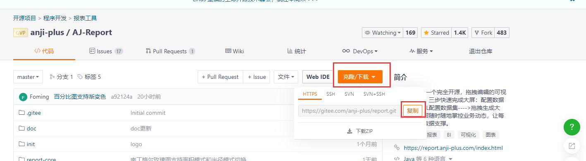
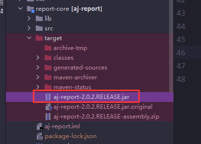
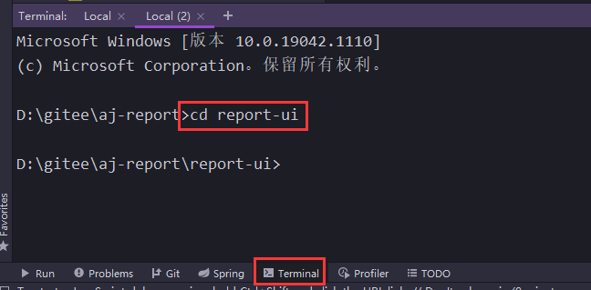
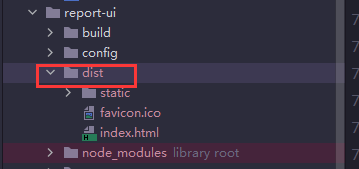

**前后端分离部署**

- 需要有一定的动手能力和排错能力
- 需要对nginx有一定了解
- 同一台机器部署前后端真心不需要分离部署
- **请根据自己的实际情况对下面的步骤和内容进行调整**

```
linux：
git clone https://gitee.com/anji-plus/report.git
后端：report-code
修改bootstrap.yml 修改数据库连接、上传下载地址等信息
maven package
java -jar

前端：report-ui
修改前端config连接
BASE_API: '"./"'，改成自己后端服务所在机器的ip地址
npm install
npm run build

使用nginx转发
```

## linux部署后端

### 编译环境

- [Apache Maven] 3.5 <br>
- [Node.js] v14.16.0 <br>
- [Jdk] 1.8 <br>

### 版本问题

已知以下版本存在兼容性问题，请不要使用

- Node.js V16及以上
- openJdk
- Jdk 1.7及以下/11及以上（jdk11部分版本有问题）
- Mysql 8.0（8.0.23/26版本没有问题，8.0.21版本存在问题）

### 克隆源码

git clone https://gitee.com/anji-plus/report.git <br>
 <br>
**注**：不要下载发行版里面的 Source Code.zip <br>

### 修改mysql连接

report-core --> src --> main --> resources --> bootstrap.yml <br>
将图中关于mysql的连接配置信息换成你使用的IP <br>

 <br>

**注 ：**

```
1、aj_report库是存放底层基础信息的库，flyway启动时会自动建立，如果你在这里修改了库，将会出错
2、请确认你的Mysql是否支持远程连接，登陆用户是否有DDL权限
```

### OSS配置

OSS底层已支持minio、amazonS3、nfs，都配置的情况下优先级minio->amazonS3->nfs <br>
 <br>

### maven打包

直接使用 maven package 打包，打包完成如图所示<br>

 <br>
**注 ：**

```
1、打包之前如果系统用的不止mysql数据源，需要自己在pom文件中加入对应的数据库的驱动，登陆系统之后，数据源提示无驱动，则选择通用JDBC数据源，这里不做演示了
2、不要使用 maven install
3、此方式不会打包 lib目录下的驱动，详情可查看 "数据源->扩展"
```

### linux启动jar包

将上步生成的jar包上传至linux，使用java -jar命令启动 <br>
**注**：请确保你的linux有jdk1.8 <br>

## 前端编译

### install

进入前端目录：report-ui <br>
 <br>
执行 npm install <br>

### 修改config

目录地址：report-ui --> config --> prod.env.js <br>
将BASE_API地址，改成自己后端服务所在机器的ip地址 <br>

### build

执行 npm run build <br>

生成的前端dist目录文件在report-ui下面 <br>

 <br>

### 前端部署

使用nginx做转发


