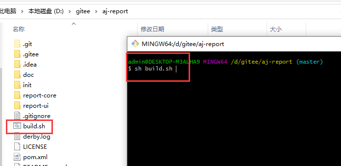
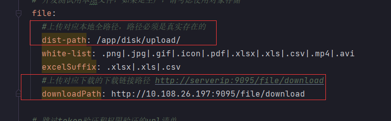
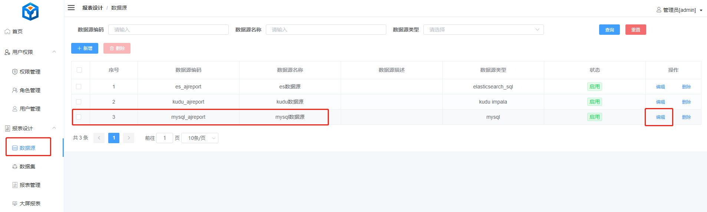

```
git clone https://gitee.com/anji-plus/report.git
cd report
sh build.sh
编译完成放在build文件夹 aj-report-xxxx.zip

unzip aj-report-xxxx.zip
cd aj-report-xxxx
vim conf/bootstrap.yml 修改数据库连接、上传文件的路径以及地址
sh bin/start.sh

访问
http://serverip:9095
```

## 编译环境

请在Linux上先准备好maven、node.js、jdk <br>
如果在Win10上部署，还需要下载一个 Git 软件，软件名就是 Git <br>
以下内容需要特别注意的地方会有对应提示。<br>

- [Apache Maven] 3.5 <br>
- [Node.js] v14.16.0 <br>
- [Jdk] 1.8 <br>
  **注**：已知**Jdk11**存在兼容性问题，请不要使用openJdk，环境问题请看 **常见问题** 大类 <br>

## 克隆源码

git clone https://gitee.com/anji-plus/report.git <br>
 <br>
**注**：不要下载发行版里面的 Source Code.zip <br>

## build

进入report目录，启动build.sh <br>
 <br>
编译完成后是放在当前目录下的build文件夹中：aj-report-xxxx.zip <br>

**注：** 如果Win10部署的话，如图用git执行sh build.sh就行了。Linux就直接去report目录下执行sh build.sh就行。 <br>
**特别注意：** 如果是Win10编译，那么几个启动脚本的格式则是win的格式，放linux上执行会报错的，反之放linux编译在win10启动也会报错，需要转格式。 <br>

## 修改mysql连接

解压aj-report-xxxx.zip，找到bootstrap.yml <br>
 <br>

将图中关于mysql的连接配置信息换成你使用的IP <br>
**注**：aj_report库是存放底层基础信息的库，flyway启动时会自动建立，如果你在这里修改了库，将会出错 <br>

 <br>
**注**：请确认你的Mysql是否支持远程连接，登陆用户是否有DDL权限 <br>

## 上传功能

使用上传功能，必须修改此内容，注意路径格式，比如Win是 \ ,linux是 / <br>


## 启动

linux启动： <br>
aj-report-XXX --> bin --> start.sh <br>
sh bin/start.sh <br>

win10启动：<br>
aj-report-XXX --> bin --> start.bat <br>
双击start.bat启动 <br>

## 日志位置

日志的位置是：report-xxx/logs/aj-report.log <br>

## 访问

http://serverip:9095 <br>
默认密码：admin 123456 <br>

## 重置mysql连接

登陆进来后请修改mysql数据源 <br>
数据源 --> mysql数据源 --> 编辑 --> 修改用户名密码（改成你自己系统mysql的用户名密码） <br>
 <br>
 <br>

