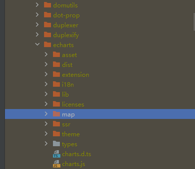

## 注意事项

- 特别注意，1.5版本开始，node版本最低使用V16版本。
- 之前版本更新至本版本时，可能会遇到图表不显示静态、动态数据，需对该图表重新配置；如果已对旧版本进行二次开发，请谨慎更新。 
  跨版本更新可查对应版本的[releases](https://gitee.com/anji-plus/report/releases)。 

## v1.4.2更新至1.5.0

- 1、下载node16
- 2、删除node_modules文件夹
- 3、清缓存，执行 npm cache clean --force
- 4、使用node16，执行 npm install

### nvm工具

用来管理多个node版本，不会的跟这个文档尝试。
https://blog.csdn.net/i_for/article/details/135060019

### 镜像源

- 查看当前源配置
  npm config get registry
- 淘宝源
  npm config set registry https://repository.npmmirror.com
- 华为源
  npm config set registry https://mirrors.huaweicloud.com/repository/npm/
- 腾讯源
  npm config set registry https://mirrors.cloud.tencent.com/npm/
- 中国科技大学源
  npm config set registry https://mirrors.ustc.edu.cn/npm/
- 网易源
  npm config set registry https://mirrors.163.com/npm/

## 1.5版本开始前端编译注意事项

前端目录：report-ui/node_modules_echarts_need/  
执行完npm install后需要将node_modules_echarts_need目录下map文件夹整体拷贝到node_modules/echarts/文件夹下，
因为echarts v5.0之后的版本不在包含map文件夹  

## 版本变化

- 1、spring-boot: 2.3.5 -> 2.7.14
- 2、node: 14 -> 16
- 3、echarts: 4.9.0 -> 5.5.1
- 4、element-ui: 2.9.2 -> 2.15.14
- 5、vue: 2.6.11 -> 2.7.16
- 6、移除node-sass
- 前端其他版本请看package.json

## 新增

- 1、新增数据集复制功能
- 2、配置文件增加时区配置
- 3、报表分享增加显示报表名称
- 4、新增柱线图-单坐标
- 5、新增使用druid1.2.0

## 优化

- 1、大屏图表-文本组件换行符默认不开启
- 2、数据集查询参数-高级规则切换优化
- 3、大屏图表-提示语配置项优化
- 4、大屏图表-数值设定配置项优化
- 5、大屏图表-散点图半重做
- 6、大屏图表-饼图系列调整
- 7、大屏图表-百分比图调整
- 8、大屏图片-地图系列-增加广东地图js
- 9、大屏数据集切换将清空原先图表属性

## 修复

- 1、修复分享链接下Excel导出异常的问题
- 2、修复滚动文本联动不生效的问题

## 其他

- 1、文档更新
- 2、ele样式调整

## 示例数据

- 从1.0版本调整了底层sql，具体位置是：report-core/src/main/resource/db.migration，
  删除了过往所有的sql，现在此目录下sql仅包含aj_report基础信息库的相关sql，sql文件的命名也会和版本号保持一致，
  提供的示例数据（aj_report_init数据库的sql），aj_report_init_example.sql 文件放置在 doc/example目录下。

- 如果需要将之前版本的示例数据删除，delete_aj_report_init_example.sql 文件放置在 doc/example目录下。

