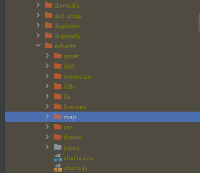

## 注意事项

- 一
  1、前端目录：report-ui/node_modules_echarts_need/  
  执行完npm install后需要将node_modules_echarts_need目录下map文件夹整体拷贝到node_modules/echarts/文件夹下，
  因为echarts v5.0之后的版本不在包含map文件夹  
  

2、执行完1之后需要修改 report-ui/node_modules/echarts目录下的package.json
在“sideEffects”追加 "map/js/\*.js" 和 "map/js/province/\*.js"  
不明白可参考：https://blog.csdn.net/m0_45159572/article/details/130077091

**注意：** 上面执行了一次就可以了，但如果都不执行，地图组件将不显示

- 二
  1.6.x 配置文件中flyway默认是true，其余配置没变化

## V1.6.0

### 新增

1、excel报表页面支持收起左侧功能栏 --贡献人：wuzhaozhongguo@wuzhaozhongguo
2、大屏设计器-文本组件增加“自定义条件样式”（仅对动态数据生效）--贡献人：lma@lma_lll
3、大屏设计器-视频组件支持循环播放 --贡献人：lma@lma_lll
4、大屏设计器-新增批量复制功能 --贡献人：luoxuancong@luoxuancong
5、大屏设计器-部分图表X轴新增“最大值”、“最小值”配置

### 优化

1、大屏设计器-图片功能优化 --贡献人：JiangHH@jianghh1993

### 修复

1、修复excel导出pdf时单元格格式都一样的问题 --贡献人：JiangHH@jianghh1993

### 其他

1、doc更新
2、部分图表Y轴“最大值”文字显示错误已调整为“最小值”
